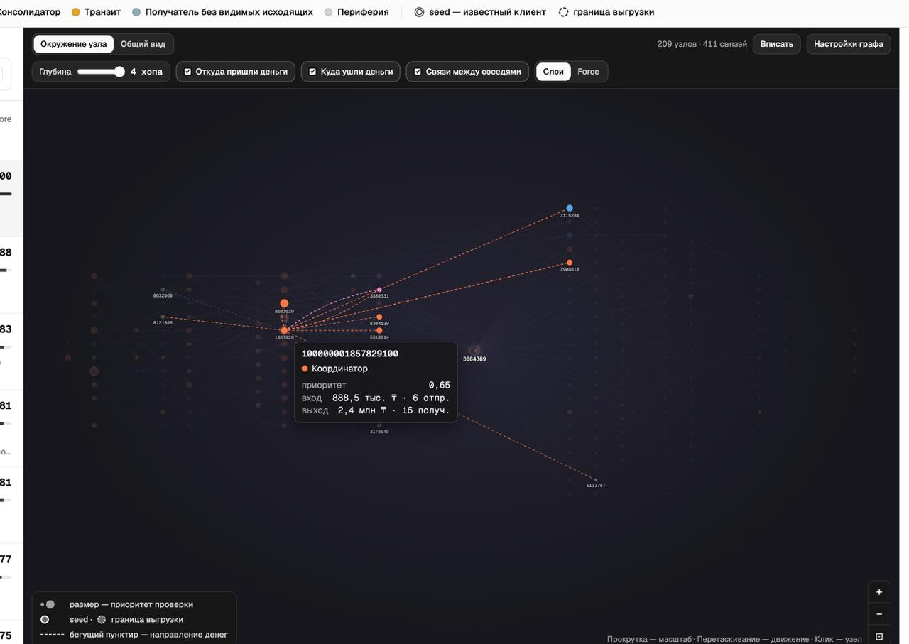
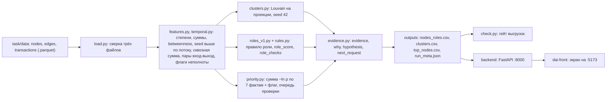

# DAI — «Граф денег»: роли и приоритеты в сети переводов

Кейс HackAlem AI «Граф денег», команда DAI.

## Быстрый запуск

Из корня репозитория, нужен Python 3.11–3.13. Сначала проверьте `python3 --version`: если там 3.10 или старее (на чистом macOS `python3` из Command Line Tools — 3.9), `make setup` не поставит зависимости, и `.venv` нужно создать нужной версией по разделу [Требования](#требования).

```bash
make setup && make pipeline
```

`make setup` создаёт `.venv` и ставит зависимости из `requirements.txt`. `make pipeline` за 2 секунды пересчитывает три CSV из `task/data/*.parquet` в `outputs/` и сразу прогоняет проверку выгрузок. Прогон удался, если последние строки такие:

```text
проверок 49, провалено 0
роли: consolidator 144, coordinator 54, distributor 29, peripheral 926, terminal 1034, transit 61
кластеров: 89
```

Интерфейс запускается отдельно, в двух терминалах: раздел [Интерфейс](#интерфейс-api-и-экран).

## Содержание

1. [Краткое описание](#краткое-описание)
2. [Что реализовано](#что-реализовано)
3. [Как работает](#как-работает)
4. [Критерии ролей и пороги](#критерии-ролей-и-пороги)
5. [Технологии](#технологии)
6. [Архитектура](#архитектура)
7. [Требования](#требования)
8. [Установка и запуск](#установка-и-запуск)
9. [Как проверить](#как-проверить)
10. [Что на выходе](#что-на-выходе)
11. [Как мы себя проверяли](#как-мы-себя-проверяли)
12. [Данные и интеграции](#данные-и-интеграции)
13. [Ограничения](#ограничения)
14. [Масштабирование до ~1 млн узлов](#масштабирование-до-1-млн-узлов)
15. [Раскрытие ранее созданного (п. 6.4)](#раскрытие-ранее-созданного-п-64)
16. [Структура репозитория](#структура-репозитория)
17. [Развёрнутая версия](#развёрнутая-версия)

## Краткое описание

Правоохранительные органы передали банку 81 клиента (`seed`), ранее выявленных как участники незаконного оборота наркотиков. Банк выгрузил исходящие переводы от них на 4 колена: 2 248 клиентов, 3 119 пар плательщик→получатель, 4 840 переводов на 365 890 012 KZT за июль 2026. Аналитику финмониторинга нужно решить, кого из 2 248 клиентов проверять первым, почему и какие данные запросить следующими.

Решение для аналитика без ML-подготовки: каждому клиенту назначаются роль по опубликованному правилу с порогами, кластер и приоритет проверки, а рядом пишется обоснование с числами. Всё это гипотезы для проверки, а не утверждения о виновности: роль «консолидатор» означает «есть признаки консолидации средств».

## Что реализовано

Пять обязательных пунктов ТЗ (§7):

| № | Пункт ТЗ | Где | Как проверить |
|---|---|---|---|
| 1 | Воспроизводимый пайплайн от parquet до трёх CSV | `pipeline/run.py`, `make pipeline` | одна команда, ≈2 с, гейт `проверок 49, провалено 0` |
| 2 | Роль, `role_score` и `evidence` у каждого узла | `outputs/nodes_roles.csv` | 2 248 строк, все обязательные колонки заполнены, `evidence` с числами ≤ 200 символов |
| 3 | Критерии ролей задокументированы | `pipeline/rules.py`, `pipeline/roles_v1.py`, раздел [Критерии ролей](#критерии-ролей-и-пороги) | колонка `role_checks` у любого `gid` показывает, какие условия правила выполнены и с какими числами |
| 4 | Кластеризация | `pipeline/clusters.py`, `outputs/clusters.csv` | 89 кластеров, `cluster_id` у каждого узла, у кластера размер, число seed, оборот и гипотеза |
| 5 | Топ-лист и визуализация | `outputs/top_nodes.csv`; `backend/` и `dai-front/` | в топе 50 узлов с обоснованием. Экран `http://localhost:5173`: поле поиска по `gid`, очередь проверки слева, окрестность узла со стрелками от плательщика к получателю (цвет — роль, обводка — seed и граница выгрузки), карточка узла справа: роль и выполненные условия, приоритет и два факта, пары переводов со статусом по датам, следующий запрос. Карта групп по кластерам — план |

Дополнительные пункты (§8), вошедшие в сдачу:

- **Обрыв графа на 4-м колене.** 444 узла глубины 4 не получают роль `terminal`: исходящие у них не собирались. У них обнуляются вклады исходящих признаков в приоритет, а в `limitations` написано «исходящие не выгружены».
- **Временной признак.** Быстрый транзит: пары «вход → выход» с суммами ±20 % и лагом 0–2 дня. Флаг у 54 узлов, проверен перестановкой дат (см. [Как мы себя проверяли](#как-мы-себя-проверяли)).
- **Оценка полноты.** У каждого узла в `next_request` указано, какие данные запросить следующими (исходящие для граничных узлов, входящие для seed, назначения платежей для пар быстрого транзита).
- **Устойчивость сети.** `pipeline/baselines.py` снимает топ-10, 20 или 50 узлов и считает остаток крупнейшей компоненты и оборота против наивных ранжирований.

## Как работает

Сценарий аналитика:

1. Аналитик получает 81 известный `gid` и выгрузку переводов на 4 колена (`task/data/`).
2. Одна команда `make pipeline` присваивает каждому из 2 248 узлов роль, кластер и приоритет, пишет обоснование и проверяет выгрузки.
3. Аналитик открывает `outputs/top_nodes.csv` или экран: первые строки топа — узлы, у которых не меньше двух фактов о переводах попадают в 5 % самых заметных.
4. По `gid` открывает карточку: роль и выполненные условия правила (`role_checks`), приоритет и два факта с наибольшим вкладом, быстрый транзит, ограничения данных по узлу и следующий запрос данных.
5. Решает, кого проверять первым, и какие данные запросить в банке.

Экран (снимки 23.09, узел из первой строки очереди):

| Окрестность узла и карточка | Общий вид с подписями кластеров |
|---|---|
|  |  |

Стрелки идут от плательщика к получателю, цвет узла — роль, размер — приоритет проверки, обводка — исходный клиент (seed) и граница выгрузки.

Концепт сценария аналитика (иллюстрация, не снимок интерфейса): слева 81 исходный клиент, между ними группы клиентов, стрелки — куда идут деньги, справа ответ «кого проверить первым» с ролью и основанием, внизу дни июля.


Что происходит внутри `make pipeline`:

1. `load.py` читает три parquet и сверяет их между собой: 2 248 узлов, 3 119 рёбер, 4 840 переводов, 81 seed, 19 изолятов, оборот 365 890 012 KZT.
2. `features.py` строит направленный граф и считает признаки узла: число разных плательщиков и получателей (`in_deg`, `out_deg`), входящий и исходящий оборот, сквозную сумму `pass_kzt = min(вход, выход)`, betweenness, PageRank, число seed, от которых узел достижим (`n_seed_upstream`), глубину и флаги неполноты.
3. `temporal.py` сопоставляет входящие и исходящие переводы узла один к одному и ставит флаг быстрого транзита.
4. `clusters.py` делит сеть на кластеры: Louvain (seed 42, resolution 1,0) на ненаправленной проекции, где вес пары — сумма переводов в обе стороны. Несвязные части сообщества разделяются, изоляты идут отдельными кластерами.
5. `roles_v1.py` назначает роль по правилам и порогам из `rules.py`.
6. `priority.py` считает единый приоритет и очередь проверки.
7. `evidence.py` пишет `evidence`, `why`, гипотезу кластера, `next_request` и `limitations`.
8. `export.py` записывает три CSV и `run_meta.json`, `check.py` проверяет выгрузки.

## Критерии ролей и пороги

Роли проверяются по порядку; узлу достаётся первая, правило которой выполнено: `coordinator > distributor > consolidator > transit > terminal > peripheral`. Правило выполнено, если выполнены все его условия.

| Роль | Смысл | Правило | Узлов |
|---|---|---|---|
| `coordinator` | связывает несколько ветвей сети, кандидат на роль организатора (гипотеза для проверки) | `in_deg ≥ 3` и `out_deg ≥ 5` и `n_seed_upstream ≥ 3`; или betweenness ≥ P99 среди узлов с `in_deg ≥ 2` и `out_deg ≥ 2` (порог ≈ 0,0061) при `in_deg ≥ 2` и `out_deg ≥ 2` | 54 |
| `distributor` | веер выходов (fan-out) | `out_deg ≥ 10` | 29 |
| `consolidator` | сходимость входов (fan-in) | `in_deg ≥ 3` | 144 |
| `transit` | пропускает средства дальше | `in_kzt > 0` и `out_kzt > 0` и (выход/вход ∈ [0,8; 1,2] у не-seed или быстрый транзит, не меньше 2 пар) | 61 |
| `terminal` | получатель без видимых исходящих | `in_deg ≥ 1` и `out_deg = 0` и глубина < 4 и не seed | 1 034 |
| `peripheral` | признаков роли не выявлено | ни одно правило выше не выполнено | 926 |

`in_deg` и `out_deg` — число разных плательщиков и получателей. У seed отношение выход/вход не используется: их входы в выгрузку не попали.

`role_score` — сила поддержки правила, а не вероятность. У назначенной роли это среднее по условиям правила: числовое условие даёт перцентильный ранг значения среди всех 2 248 узлов (0–1), булево даёт 1. У `peripheral` это 1 минус максимальная поддержка по остальным ролям, то есть насколько узел далёк от любого правила.

Все пороги лежат в одном месте, `pipeline/rules.py`, и записываются в `outputs/run_meta.json`. Таблица ниже — вывод `print_thresholds()`, квантили посчитаны по 2 248 узлам:

```bash
.venv/bin/python -c "from pipeline.rules import print_thresholds; print_thresholds()"
```

| порог | значение | где на распределении |
|---|---|---|
| `coordinator_min_in_deg` | 3 | in_deg: P90/P95/P99 = 2/3/6; 91,1 % узлов ниже 3 |
| `coordinator_min_out_deg` | 5 | out_deg: P90/P95/P99 = 3/5/23,5; 94,2 % узлов ниже 5 |
| `coordinator_min_seed_upstream` | 3 | n_seed_upstream: P25 = 1, P50 = P75 = 7, P90 = 9; 28,9 % узлов ниже 3 (при ≥2 было 27,3 %); у всех 54 координаторов ≥ 6, так что 2→3 никого не отсекает |
| `coordinator_betweenness_q` | 0.99 | альтернативная ветка: betweenness ≥ P99 среди узлов |
| `coordinator_betweenness_min_deg` | 2 |  |
| `distributor_min_out_deg` | 10 | out_deg ≈ P97 (97,2 % узлов ниже 10) |
| `consolidator_min_in_deg` | 3 | in_deg P95 |
| `transit_ratio_low` | 0.8 | out_kzt/in_kzt ∈ [0,8; 1,2] (72 узла) или быстрый транзит |
| `transit_ratio_high` | 1.2 |  |
| `terminal_min_in_deg` | 1 | in_deg P5 < 1: 1,9 % узлов без входов |
| `terminal_max_depth_exclusive` | 4 | глубина 4 — граница выгрузки, исходящие не собирались |
| `peripheral_score` | 0.3 | только v0: role_score периферии фиксирован; в v1 — 1 − макс. поддержка других ролей |
| `coordinator_in_norm` | 6 | только v0 (запасной метод) |
| `coordinator_out_norm` | 10 | только v0 (запасной метод) |
| `distributor_out_norm` | 25 | только v0 (запасной метод) |
| `consolidator_in_norm` | 8 | только v0 (запасной метод) |
| `terminal_score` | 0.5 | только v0 (запасной метод) |
| `priority_w_pagerank` | 0.5 | только v0 (запасной метод) |
| `priority_w_degree` | 0.4 | только v0 (запасной метод) |
| `priority_w_seed` | 0.1 | только v0 (запасной метод) |
| `ROLE_ORDER` | coordinator > distributor > consolidator > transit > terminal > peripheral | первая сработавшая роль |
| `PRIORITY_THRESHOLD_RAW` | 6 | справочный порог суммы, не очередь |
| `QUEUE_MIN_TERMS_ABOVE_P95` | 2 | очередь: столько признаков в верхних 5 % |
| `TERM_P95_CONTRIBUTION` | 2.9957 | вклад признака в верхних 5 %: −ln 0,05 |
| `FAST_TRANSIT_WEIGHT` | 1 | добавка к priority_raw при флаге |

### Приоритет и очередь проверки

Приоритет помогает выбрать, кого проверить первым. Семь показателей описывают суммы переводов, число разных плательщиков и получателей, положение клиента между другими клиентами, меньшую из входящей и исходящей сумм и число исходных клиентов, связанных с ним по графу. Редкое значение даёт больше баллов. Повторные пары переводов похожей суммы за 0–2 дня добавляют один балл. Клиент попадает в очередь проверки, если хотя бы два из семи показателей входят в верхние 5 % среди 2 248 клиентов. Баллы не показывают вероятность нарушения.

Формально: приоритет — один скор по семи фактам о переводах: входящий и исходящий оборот, число плательщиков и получателей, betweenness, сквозная сумма, число seed выше по потоку. Для факта со значением x вклад равен `−ln p`, где `p` — доля узлов со значением не меньше x. Факт, которым обладает 5 % узлов, даёт вклад 3,0; нулевое значение даёт 0. К сумме добавляется 1,0 при флаге быстрого транзита. У 444 граничных узлов глубины 4 вклады исходящего оборота, числа получателей и сквозной суммы равны 0.

- `priority_raw` — эта сумма; `priority_score` = `priority_raw` / максимум по выгрузке (41,2), шкала 0–1.
- Очередь проверки (`in_queue = 1`): не меньше двух фактов из семи среди 5 % самых заметных, то есть вклад ≥ −ln 0,05 ≈ 3,0. В очереди 165 узлов (7,3 %), все 50 узлов топа в неё входят.
- Порог суммы 6,0 справочный: из-за корреляции фактов его набирают многие средние узлы (681 из 2 248), поэтому очередь задаётся правилом двух фактов.
- `top_nodes.csv` — первые 50 узлов по `priority_raw`, при равенстве по `gid`.
- В `evidence` и `why` — роль с числами, два факта с наибольшим вкладом и их перцентили, число фактов выше P95, флаг быстрого транзита и ограничения данных.

Запасной метод v0 (только пороги стартовых гипотез, приоритет по PageRank и степени) оставлен на случай отката: `.venv/bin/python -m pipeline.run --data task/data --out outputs --method v0`. Сдаётся v1. Команда перезаписывает `outputs/` выгрузкой v0: после неё шаги 3–4 раздела [Как проверить](#как-проверить) дадут расхождение CSV с git и провал `--require-method v1`. Вернуть v1 — `make pipeline`.

## Технологии

| Часть | Стек |
|---|---|
| Пайплайн | Python 3.11–3.13; pandas 2.3.3, pyarrow 20.0.0, networkx 3.4.2 (Louvain, betweenness, PageRank), scipy 1.16.2, numpy; версии закреплены в `requirements.txt` |
| API | FastAPI 0.139.0, uvicorn 0.44.0, pydantic 2.12.5 |
| Интерфейс | React 19.3, TypeScript 6.0.3, Vite 8.3, Tailwind CSS 4.3, TanStack Router и Query, Hey API (клиент из OpenAPI); d3 7.9 в зависимостях под схему сети (схема — план); Node ≥ 22.18, проверено на 24.13 и 26.8, версии в `dai-front/package-lock.json` |

Платных API, GPU, внешних сервисов и секретных ключей решение не использует.

## Архитектура

Пайплайн работает пакетно и пишет файлы в `outputs/`. API читает эти CSV и исходные parquet и отдаёт карточки, окрестности и топ. Интерфейс ходит в API через прокси Vite `/api`. Контракт `dai-front/openapi.json` генерируется из бэкенда.

Схема решения: данные → метрики → роли → интерфейс.



## Требования

- Python 3.11, 3.12 или 3.13: `python3 --version`. На 3.9 не ставится fastapi 0.139.0, на 3.10 — scipy 1.16.2. Симптом: `make setup` заканчивается строками `Could not find a version that satisfies the requirement …` и `No matching distribution found for …`, а выше стоит `require a different python version` или `Requires-Python`. Это версия Python, а не сеть: при сбое сети в выводе `nodename nor servname provided` или `Failed to establish a new connection` (раздел [Если нет сети](#если-нет-сети)).
- `make` (на macOS и Linux есть; без него команды из раздела [Без make](#без-make)).
- Для интерфейса: Node.js не ниже 22.18 (`node --version`), npm. Проверено на Node 24.13 (версия из `dai-front/.nvmrc`) и 26.8.
- Сеть нужна только на установку зависимостей: pypi.org для pip, registry.npmjs.org для npm. Пайплайн и API сетевых вызовов не делают.
- Свободные порты 8000 (API) и 5173 (интерфейс); как сменить — в разделе [Смена портов](#смена-портов).

Если системный `python3` старее 3.11, создайте `.venv` нужной версии до `make setup`, любым из способов:

```bash
uv venv --python 3.11 .venv && uv pip install --python .venv/bin/python -r requirements.txt
```

```bash
python3.11 -m venv .venv && .venv/bin/pip install -r requirements.txt
```

`uv` ставится по инструкции docs.astral.sh/uv; `python3.11` — установщиком с python.org или `brew install python@3.11`. После этого `make setup` не нужен, сразу `make pipeline`. Если `.venv` уже создан другой версией Python (в том числе упавшим `make setup`), сначала удалите его: `rm -rf .venv`. Версию в `.venv` проверяет `.venv/bin/python --version`.

## Установка и запуск

Все команды — из корня репозитория.

### Пайплайн

```bash
make setup      # .venv и зависимости из requirements.txt
make pipeline   # task/data/*.parquet → outputs/*.csv, затем проверка выгрузок
make check      # только проверка выгрузок (код возврата 1 при нарушении)
```

Ожидаемый вывод `make pipeline` (замер 23.09.2026, MacBook на Apple M4 Max, Python 3.11; время на другой машине другое, в ТЗ лимит 5 минут). Строка `готово за` считает только расчёт; вместе с загрузкой библиотек команда идёт 4–5 с, а первый запуск в только что созданном `.venv` дольше: на чистом клоне с Python 3.13.5 записано 28,6 с ([docs/acceptance.md](docs/acceptance.md)).

```text
готово за 1.81 s: outputs/nodes_roles.csv, outputs/clusters.csv, outputs/top_nodes.csv, outputs/run_meta.json
роли: consolidator=144, coordinator=54, distributor=29, peripheral=926, terminal=1034, transit=61
кластеров: 89
очередь проверки: 165 узлов (...)
...
проверок 49, провалено 0
роли: consolidator 144, coordinator 54, distributor 29, peripheral 926, terminal 1034, transit 61
кластеров: 89
```

Число строк в выгрузках:

```bash
wc -l outputs/nodes_roles.csv outputs/clusters.csv outputs/top_nodes.csv
```

```text
    2249 outputs/nodes_roles.csv
      90 outputs/clusters.csv
      51 outputs/top_nodes.csv
```

Это 2 248 узлов, 89 кластеров и 50 узлов топа плюс строка заголовка в каждом файле.

### Без make

macOS и Linux:

```bash
python3 -m venv .venv
.venv/bin/pip install -r requirements.txt
.venv/bin/python -m pipeline.run --data task/data --out outputs
```

Windows (PowerShell, не проверялось):

```powershell
py -3.11 -m venv .venv
.venv\Scripts\pip install -r requirements.txt
.venv\Scripts\python -m pipeline.run --data task/data --out outputs
```

`pipeline.run` сам запускает проверку выгрузок; флаг `--no-check` её отключает.

### Интерфейс: API и экран

Сначала `make pipeline`: API читает `outputs/`. Без выгрузок API отдаёт заглушку с пометкой `mock: true`.

Терминал 1, API на порту 8000:

```bash
make api
```

Проверка: `curl -s localhost:8000/health` → `{"status":"ok","mock":false}`.

Терминал 2, интерфейс на порту 5173:

```bash
cd dai-front
cp .env.example .env.development
npm ci
npm run dev
```

Без `.env.development` клиент не знает адрес API и главная страница не открывается; `make web` копирует его из `.env.example`, если файла ещё нет, затем делает `npm ci` и `npm run dev`.

`gid` для проверки — из первой строки `outputs/top_nodes.csv`; команда печатает готовый адрес страницы узла:

```bash
TOP_GID=$(python3 -c "import csv; print(next(csv.DictReader(open('outputs/top_nodes.csv', encoding='utf-8')))['gid'])")
echo "http://localhost:5173/nodes/$TOP_GID"
```

Откройте напечатанный адрес или просто `http://localhost:5173`: на главной странице поле поиска по `gid`, очередь проверки и схема сети; клик по строке очереди или ввод `gid` открывает узел. Слева поиск и очередь, в центре окрестность узла (стрелки показывают направление денег, цвет узла — роль, размер — приоритет, обводка — seed и граница выгрузки), справа карточка: роль и выполненные условия правила, приоритет и два факта с наибольшим вкладом, отметка «в очереди проверки», пары переводов со статусом по датам, следующий запрос и ограничения данных. Другой узел: ввести `gid` в поиск или заменить его в адресе.

В таблице «Экраны» в [dai-front/README.md](dai-front/README.md) все четыре экрана, включая карточку узла, стоят со статусом «план». Это верно для целевых экранов по макету; текстовая страница узла выше в таблицу не входит.

Те же данные доступны напрямую из API, в том же терминале, где задан `TOP_GID`:

```bash
curl -s "localhost:8000/top?limit=5"
curl -s "localhost:8000/nodes/$TOP_GID"
curl -s "localhost:8000/nodes/$TOP_GID/subgraph?radius=1"
```

`/nodes/{gid}` отдаёт карточку с переводами, `/subgraph` — узлы и направленные рёбра окрестности. Если пайплайн перезапущен при работающем API, `curl -X POST localhost:8000/reload` перечитывает `outputs/`. Остальные эндпоинты и переменные окружения — в [backend/README.md](backend/README.md).

### Смена портов

Если 8000 занят, поднимите API на другом порту и направьте на него прокси интерфейса:

```bash
.venv/bin/uvicorn backend.app.main:app --port 8001
```

```bash
cd dai-front
API_PROXY_TARGET=http://localhost:8001 npm run dev -- --port 5174
```

Если занят 5173, Vite сам берёт следующий свободный порт и печатает адрес в строке `Local:`; в адресе страницы узла тогда нужен этот порт. Кто занял порт: `lsof -i :8000` (или `:5173`). Остановить API и интерфейс — Ctrl+C в их терминалах.

### Если нет сети

- pip: `Could not find a version that satisfies the requirement` при `nodename nor servname provided` — это недоступный pypi.org, а не ошибка в `requirements.txt`. Если зависимости уже есть в кэше uv, помогает `uv pip install --offline --python .venv/bin/python -r requirements.txt`.
- npm: `ENOTFOUND registry.npmjs.org` или `EAI_AGAIN` — не резолвится имя реестра, это сеть или DNS машины, а не ошибка в `package-lock.json`. Обход: `npm ci --prefer-offline` берёт пакеты из локального кэша npm. Он помогает, только если все пакеты из lockfile уже есть в кэше; если какого-то нет, та же ошибка `ENOTFOUND` повторится, и нужна сеть (или другой DNS-сервер, если связь по IP есть).

## Как проверить

Сценарий на чистой машине, 5–10 минут:

1. `make setup && make pipeline` → в конце `проверок 49, провалено 0` и строка с числом ролей. Время прогона — в строке `готово за … s`.
2. `wc -l outputs/nodes_roles.csv outputs/clusters.csv outputs/top_nodes.csv` → 2249, 90, 51.
3. Детерминизм: `git status --short outputs/` показывает изменённым только `outputs/run_meta.json` (в нём время запуска и длительность). Три CSV побайтно совпадают с закоммиченными.
4. Строгая проверка: `.venv/bin/python -m pipeline.check --data task/data --out outputs --require-method v1` → `проверок 51, провалено 0`.
5. Пять контрольных случаев с ожидаемыми ролями, основаниями и следующим запросом — [docs/acceptance.md](docs/acceptance.md). Каждый `gid` вводится в поле поиска на экране (или открывается по адресу `http://localhost:5173/nodes/<gid>`). Для трёх любых других `gid` колонки `role_checks`, `evidence`, `score_terms` в `outputs/nodes_roles.csv` показывают, почему роль именно такая и откуда приоритет. Например, так:

   ```bash
   .venv/bin/python -c "import pandas as pd; d=pd.read_csv('outputs/nodes_roles.csv', dtype={'gid':'int64'}); print(d.sample(3, random_state=1)[['gid','role','role_score','role_checks','evidence']].to_string())"
   ```

6. Экран: терминал 1 `make api`, терминал 2 — команды из раздела [Интерфейс](#интерфейс-api-и-экран), затем страница узла из первой строки `outputs/top_nodes.csv` (адрес печатает команда с `TOP_GID` в том же разделе).
7. Временной признак против случайных дат: `.venv/bin/python -m pipeline.temporal_check --data task/data` (≈1 с, 1 000 перестановок).
8. Сравнение с наивными ранжированиями: `.venv/bin/python -m pipeline.baselines --data task/data --out outputs` (≈1 с). Файлов не пишет, числа — в таблице раздела [Как мы себя проверяли](#как-мы-себя-проверяли).
9. Проверки выгрузок без разметки (устойчивость топа к шуму, чувствительность ролей к порогам, стабильность кластеров по seed Louvain и другие): `make metrics` (≈5 с). Успех — последняя строка `проверок …; обязательных провалено 0; …`; строки `WARN` — предупреждения, а не провал. Команда перезаписывает `outputs/metrics.json` (время запуска и замеры), поэтому после неё `git status` покажет изменённым и его. Смысл проверок — [docs/ds_metrics_2026-09-23.md](docs/ds_metrics_2026-09-23.md).

`gid` — 18-значные целые. Excel и Numbers показывают их как `1E+17` и теряют цифры: открывайте CSV в текстовом редакторе или через `pandas.read_csv(..., dtype={"gid": "int64"})`.

## Что на выходе

Все три файла — в `outputs/`, кодировка UTF-8. Обязательные колонки ТЗ идут первыми, за ними дополнительные.

`nodes_roles.csv` — 2 248 строк, по одной на узел:

| Колонки | Смысл |
|---|---|
| `gid`, `role`, `role_score`, `cluster_id`, `priority_score`, `evidence` | обязательные по ТЗ |
| `is_seed`, `depth`, `in_deg`, `out_deg`, `in_kzt`, `out_kzt`, `in_tx`, `out_tx`, `pass_kzt`, `pass_through`, `pagerank`, `betweenness`, `n_seed_upstream`, `active_days`, `first_date`, `last_date`, `truncated_by_depth`, `flags` | признаки узла |
| `fast_transit_pairs`, `fast_transit_flag` | число пар быстрого транзита и флаг (≥ 2 пар) |
| `priority_raw`, `score_terms`, `n_terms_above_p95`, `in_queue` | сырой скор, два главных вклада, число фактов выше P95, очередь проверки |
| `role_checks` | условия правила роли с числами и отметками ✓/✗ |
| `next_request`, `limitations` | следующий запрос данных и ограничения данных по узлу |
| `method` | `v1` |

`clusters.csv` — 89 строк:

| Колонки | Смысл |
|---|---|
| `cluster_id`, `n_nodes`, `n_seed`, `sum_kzt_internal`, `top_gids`, `hypothesis` | обязательные по ТЗ; `top_gids` — до 5 `gid` через `;` по убыванию приоритета |
| `n_edges_internal`, `share_depth4` | число рёбер внутри кластера, доля узлов глубины 4 |

`top_nodes.csv` — 50 строк:

| Колонки | Смысл |
|---|---|
| `rank`, `gid`, `role`, `priority_score`, `why` | обязательные по ТЗ |
| `cluster_id`, `priority_raw`, `score_terms`, `in_queue` | кластер, сырой скор, главные вклады, очередь |

`run_meta.json` — параметры прогона: пороги, порядок ролей, число узлов по ролям, параметры Louvain, правило очереди, время по стадиям, версии библиотек.

`check.py` проверяет схему и согласованность выгрузок с parquet: колонки и их порядок, 2 248 уникальных `gid` из `nodes.parquet`, роли из словаря, `role_score` и `priority_score` в [0; 1], `evidence` непустой, с числом и не длиннее 200 символов, ни один узел глубины 4 не `terminal`, суммы узлов и seed по кластерам, `top_gids` внутри своего кластера, в топе не меньше 20 строк и приоритет не растёт, `in_queue` сходится с `run_meta.json`.

## Как мы себя проверяли

- **Гейт выгрузок.** 49 проверок `pipeline/check.py` после каждого прогона, 51 с `--require-method v1`; все проходят. Ожидаемые числа (узлы, seed, оборот) гейт берёт из parquet, а не из констант.
- **Детерминизм.** Повторный прогон и прогон на чистой копии репозитория с новым `.venv` дают побайтно те же три CSV, что закоммичены. Louvain запускается с seed 42, сортировки стабильные.
- **Граница выгрузки.** 0 из 444 узлов глубины 4 получили роль `terminal` (441 — `peripheral`, 3 — `consolidator`). Наивное правило «нет исходящих ⇒ конечный получатель» дало бы 444 ложных `terminal`.
- **Быстрый транзит против случайных дат.** `pipeline/temporal_check.py` 1 000 раз переставляет даты переводов двумя способами: по всей выгрузке и внутри отправителя (сохраняет активность каждого отправителя). Флаг получают 54 узла против 34,1 и 38,2 в среднем при перестановках, p = 0,001. Поэтому признак вошёл в приоритет флагом с весом 1,0. Гипотезу «узел платит раньше, чем получает» мы проверили так же: 45 узлов против 38,4 и 40,5 при перестановках, p = 0,054 и 0,167. Это не отличается от случайного, и в приоритет признак не вошёл. По разбору в [docs/hypothesis_check_2026-09-23.md](docs/hypothesis_check_2026-09-23.md) около половины флагов быстрого транзита появляются и на случайных датах у столь же активных узлов, поэтому число пар как непрерывный признак не используется.
- **Сравнение с наивными ранжированиями** (`pipeline/baselines.py`, снятие топ-N узлов, случайный порядок — медиана 20 повторов):

  | Ранжирование | Доля оборота на снятых узлах, топ-10 / 20 / 50 | Крупнейшая компонента после снятия (из 1 877) |
  |---|---|---|
  | наш `priority_score` | 25,5 % / 35,1 % / 51,6 % | 1 456 / 1 243 / 930 |
  | по обороту | 28,6 % / 37,7 % / 56,3 % | 1 466 / 1 376 / 1 034 |
  | по числу контрагентов | 23,1 % / 30,3 % / 46,7 % | 1 428 / 1 188 / 620 |
  | PageRank стартового кода | 6,0 % / 7,2 % / 12,9 % | 1 846 / 1 834 / 1 749 |
  | случайный | 0,7 % / 1,6 % / 4,6 % | 1 863,5 / 1 845 / 1 792 |

  Наш скор лучше случайного порядка и PageRank по обоим исходам. Ранжирование по обороту снимает больше оборота, по числу контрагентов сильнее дробит сеть: скор — компромисс между ними, а не победитель по каждому исходу. Кластеры: модулярность 0,859 против 0,125 у слабосвязных компонент и около 0 у случайного разбиения тех же размеров. Эти исходы косвенные: меток ролей в данных нет, и «лучше наивного» не означает «правильно».

## Данные и интеграции

Только файлы организаторов в `task/data/` (описание полей — [task/README.md](task/README.md)). Внешних источников, обогащения, LLM и ключей нет. Интернет нужен только для установки зависимостей.

API (`backend/`) читает `outputs/*.csv` и `task/data/*.parquet`; пути меняются переменными `DAI_OUTPUTS_DIR` и `DAI_DATA_DIR`. Интерфейс получает данные только из API.

## Ограничения

Ограничения данных, объявленные в ТЗ, и как они учтены:

- Обрыв на 4-м колене: у 444 узлов исходящие не собирались. Они не получают роль `terminal`, их исходящие вклады в приоритет обнулены, в `next_request` — запрос исходящих.
- Только исходящий обход: у 81 seed входящие суммы занижены. Отношение выход/вход у seed не используется, в `evidence` написано «входы неполны».
- Переводы меньше 5 000 KZT в выгрузку не попали: дробление ниже порога не видно.
- 19 seed без рёбер — изоляты, отдельные кластеры и роль `peripheral` с пометкой «переводов в выгрузке нет».
- Даты с точностью до дня: порядок переводов внутри дня неизвестен, лаг 0 означает «в тот же день».
- Атрибутов клиентов и разметки ролей нет, поэтому оценка — по обоснованности правил, а не по точности.

Ограничения подхода:

- Пороги ролей выбраны по квантилям распределений этой выгрузки, а не обучены; на другой выгрузке их нужно пересчитать.
- Роль одна на узел: узел, подходящий под несколько правил, получает первую по `ROLE_ORDER`. В `role_checks` записаны условия только назначенной роли, у `peripheral` — ближайшая роль и её поддержка.
- Роли описывают видимые направления переводов. Они не устанавливают, кто распоряжается счетом и кому принадлежат деньги после поступления.
- Кластеры — сообщества переводов, а не доказанные группы; Louvain на другом seed даёт близкое, но не идентичное разбиение.
- Приоритет ранжирует необычность узла среди этих 2 248, а не вероятность нарушения. Факты коррелируют (оборот и число контрагентов растут вместе), поэтому сумма вкладов частично учитывает одно и то же дважды.
- Экран показывает окрестность узла, очередь и карточку; отдельная карта групп по кластерам и временная шкала переводов — план.

## Масштабирование до ~1 млн узлов

Текущий расчёт занимает 1,8 с, из них 1,0 с — точный betweenness. При росте до миллиона узлов изменится:

- **Граф.** networkx → igraph или networkit. Точный betweenness растёт как произведение числа узлов и рёбер, поэтому нужна выборочная оценка по k источникам.
- **Кластеры.** Louvain → Leiden (гарантирует связность сообществ), при необходимости по компонентам параллельно.
- **Таблицы.** pandas → polars или DuckDB с чтением parquet по партициям. Приоритет считается по перцентилям признаков и переносится как есть: нужны только ранги по каждому признаку.
- **Временной слой.** Сопоставление пар вход→выход уже векторизовано по узлам; на полном потоке — окном по датам и по партициям отправителей.
- **Хранение и API.** Выгрузки → Postgres или графовая БД; API отдаёт окрестности узла и агрегаты кластеров, а не граф целиком; пересчёт — только компонент, в которых появились новые переводы.
- **Интерфейс.** Схема сети показывает окрестность выбранного узла и кластера, а не всю сеть.

## Раскрытие ранее созданного (п. 6.4)

- `task/` — материалы организаторов, включая стартовый код `task/starter/`; не изменялись. Загрузка в `pipeline/load.py` повторяет логику `task/starter/starter.py`.
- Каркас интерфейса `dai-front/` (коммиты `front-setup` и `front-docs`), каталог `.claude/skills` и файлы `CLAUDE.md` созданы до старта как шаблон стека. Скилы shadcn и TanStack — сторонние, официальные от авторов библиотек.
- Всё остальное — пайплайн `pipeline/`, API `backend/`, экраны кейса, документы `docs/`, этот README — написано 23.09.2026, в день хакатона.

## Структура репозитория

| Путь | Назначение |
|---|---|
| `task/` | ТЗ, данные и стартовый код организаторов, без изменений |
| `pipeline/` | анализ графа и генерация CSV: `run.py` (вход), `rules.py` (пороги), `roles_v1.py`, `priority.py`, `temporal.py`, `clusters.py`, `evidence.py`, `export.py`, `check.py` (гейт), `temporal_check.py`, `baselines.py` и `metrics.py` (проверки) |
| `outputs/` | итоговые `nodes_roles.csv`, `clusters.csv`, `top_nodes.csv`, `run_meta.json`; `metrics.json` — отчёт `make metrics` |
| `backend/` | API на FastAPI для интерфейса; [запуск и эндпоинты](backend/README.md) |
| `dai-front/` | интерфейс на React; [запуск, переменные окружения, стек](dai-front/README.md) |
| `docs/` | гипотезы и их проверка: [временной признак](docs/hypothesis_check_2026-09-23.md), [смежные работы](docs/related_work_2026-09-23.md), [сценарий аналитика](docs/aml_analyst_ajtbd.md), [порядок переводов](docs/temporal_research.md), [контрольные случаи](docs/acceptance.md), [проверки без разметки](docs/ds_metrics_2026-09-23.md), [устройство системы](docs/ds_system_design_2026-09-23.md) |
| `Makefile` | `setup`, `pipeline`, `check`, `metrics`, `baselines` (пишет `outputs/baselines.json`, в git его нет), `api`, `web`, `contract` |
| `requirements.txt` | зависимости пайплайна и API с закреплёнными версиями |

Стартовый код организаторов можно запустить отдельно, его вывод не входит в сдачу:

```bash
.venv/bin/python task/starter/starter.py --data task/data --out scratch/starter
```

## Развёрнутая версия

Нет. Решение запускается локально по шагам выше.
