# Системный дизайн DS-модуля «Граф денег»

Дата: 23.09.2026, 16:40 (Asia/Almaty); сверка имён, порогов и ключей с `related_work`, `hypothesis_check`, `backend/app/data.py` и кодом `pipeline/` на 16:45 (заморозка) — §7 (принятые решения и оставшиеся расхождения) и §8 (глоссарий). Связанные документы: `related_work_2026-09-23.md` (§«Берём сейчас»: единый скор, быстрый транзит, типологии, устойчивость), `hypothesis_check_2026-09-23.md` (временной слой), `ds_metrics_2026-09-23.md` (метрики качества и проверки без меток). Решения по кластеризации (вес U, resolution, seed, порядок `cluster_id`) и стартовые квантили ролей взяты из исследовательских заметок вне репозитория от 23.09 (раскрываются в README по п. 6.4) и перечислены в §2.4 и §2.5. Все числа ниже пересчитаны на выданных данных (2 248 узлов, 3 119 рёбер, 4 840 переводов, июль 2026) на ноутбуке с Python 3.11, pandas 2.3.3, networkx 3.4.2, numpy 1.26.4; время указано для одного ядра без прогрева.

## 1. Назначение и граница модуля

DS-модуль превращает три parquet-файла в очередь проверки для AML-аналитика: роль каждого клиента, силу поддержки роли, кластер, приоритет и объяснение числами. Он живёт в каталоге `pipeline/`, развивается независимо от бэкенда и связан с ним одним контрактом: тремя CSV по схеме ТЗ §7 и двумя вспомогательными JSON.

Вход (только чтение): `task/data/nodes.parquet` (`gid` int64, `depth` 0–4, `is_seed`), `task/data/edges.parquet` (`src`, `dst`, `sum_kzt`, `n_tx`, `depth`), `task/data/transactions.parquet` (`src`, `dst`, `date` с точностью до дня, `sum_kzt`).

Выход в `outputs/`:

| Файл | Кто читает | Содержание |
| --- | --- | --- |
| `nodes_roles.csv` | бэкенд, жюри | 2 248 строк: `gid`, `role`, `role_score`, `cluster_id`, `priority_score`, `evidence` + дополнительные колонки (§2.9), в том числе `priority_raw` и вклады `term_<feature>` |
| `clusters.csv` | бэкенд, жюри | `cluster_id`, `n_nodes`, `n_seed`, `sum_kzt_internal`, `top_gids`, `hypothesis` + `n_edges_internal`, `share_depth4` |
| `top_nodes.csv` | бэкенд, жюри | 50 строк: `rank`, `gid`, `role`, `priority_score`, `why` + `cluster_id`, `priority_raw`, `score_terms`, `in_queue` (`export.py` 16:19) |
| `metrics.json` | README, `ds_metrics_2026-09-23.md` | пишет `metrics.py` (§2.11): массив проверок `checks`, устойчивость кластеров по seed, таблица изъятия топ-N, доля узлов над порогом |
| `run_meta.json` | бэкенд (`/meta`), README | `method`, `seed`, `versions`, `elapsed_s`, `stages_s` (дубль `stages` для `metrics.py`), `thresholds` (пороги ролей из `rules.THRESHOLDS`), `n_in_queue`, `queue_rule`, `queue_min_terms_above_p95`, `n_terms_above_p95_dist`, `max_priority_raw`, справочно `threshold_raw` 6,0, `threshold_score` = 6,0 / max и `n_above_threshold` (очередью не являются), `weights`, `boundary_zero_terms`, `n_clusters`, `fast_transit`, `role_counts`; ключи по `run.py`; `betweenness_mode` и sha256 входов пока не пишутся |

Пары «вход → выход» для карточки узла отдельным файлом не выгружаются: их считает API на лету функцией `pipeline/temporal.py::node_pairs(tx, gid)` (решение плана §9; 38 311 пар строятся за 0,006 с).

Модуль не делает: не импортирует ничего из `backend/`, не ходит в сеть, не читает переменные окружения кроме путей `--data` и `--out`, не хранит состояние между запусками, не меняет входные файлы, ничего не обучает на данных. Бэкенд видит только файлы в `outputs/`; смена формул внутри модуля меняет значения и `run_meta.method`, схему файлов не трогает (правила эволюции контракта в плане §3.4).

Запуск: `python -m pipeline.run --data task/data --out outputs [--method v1] [--seed 42]`. Один процесс, одна команда, без аргументов на демо.

## 2. Архитектура по стадиям

Файлы совпадают с планом §2: `load.py`, `features.py`, `clusters.py`, `temporal.py`, `temporal_check.py` (перестановочный контроль, в основной запуск не входит), `rules.py`, `roles_v0.py` (пороги заглушки, запасной вариант сдачи и стоп-кран 16:50), `roles_v1.py`, `priority.py`, `evidence.py`, `export.py`, `check.py`, `metrics.py`, `explain.py`. Стадии вызываются из `run.py` последовательно; каждая принимает и возвращает `pandas.DataFrame` с индексом `gid` (int64), порядок строк совпадает с `nodes.parquet`, отсортированным по `gid`.

### 2.1 `load.py` — загрузка и проверка входа

```python
def load_and_validate(data_dir: Path) -> tuple[pd.DataFrame, pd.DataFrame, pd.DataFrame]:
    """nodes[gid, depth, is_seed], edges[src, dst, sum_kzt, n_tx, depth], tx[src, dst, day, sum_kzt]."""
```

Проверки, при нарушении — исключение с текстом: `gid` уникален; все `src`/`dst` рёбер и переводов есть в `nodes`; `sum_kzt > 0`; `n_tx ≥ 1`; агрегат переводов по паре (`src`, `dst`) совпадает с `edges` по сумме (допуск 0,01 KZT) и по числу строк; даты внутри одного месяца. Повторяющиеся строки переводов (97 строк в 75 группах) не удаляются: без идентификатора операции дубль и два одинаковых перевода за день неразличимы. `nodes` сортируется по `gid`, `edges` по (`src`, `dst`), `tx` по (`src`, `dst`, `day`, `sum_kzt`); `day` = номер дня месяца (int8). Все три таблицы, включая переводы, проходят через эту стадию: `temporal.py` получает уже проверенный и отсортированный `tx`. Замер: 0,2 с.

### 2.2 `features.py::build_graphs` — два представления

```python
def build_graphs(nodes: pd.DataFrame, edges: pd.DataFrame) -> tuple[nx.DiGraph, nx.Graph]:
    """G: направленный, все 2 248 узлов (19 изолятов включены), рёбра с sum_kzt и n_tx.
    U: ненаправленная проекция для сообществ. U.add_nodes_from(все 2 248 gid по возрастанию);
    атрибут ребра sum_kzt = sum_kzt(A→B) + sum_kzt(B→A). G.to_undirected() не использовать:
    он оставляет одно направление в каждой из 177 встречных пар и теряет 31 649 300,77 KZT."""
```

Инварианты после построения: `abs(U.size(weight="sum_kzt") − edges.sum_kzt.sum()) < 0,01` (сумма весов U равна обороту 365 890 012 KZT), `U.number_of_nodes() == 2248`. В данных 2 942 неупорядоченные пары, 177 из них с обоими направлениями. Имя атрибута веса одно и то же в `build_graphs` и в вызове Louvain: при несовпадении имён networkx молча берёт вес 1, и невзвешенный Louvain на тех же данных даёт 61 сообщество и внутренний оборот 314,5 млн KZT. G используется для всех признаков, ролей и экрана; U только для Louvain. Замер: 0,05 с.

### 2.3 `features.py::compute_features` — признаки

```python
def compute_features(G: nx.DiGraph, nodes: pd.DataFrame, edges: pd.DataFrame, tx: pd.DataFrame) -> pd.DataFrame:
    """Индекс gid. Колонки ниже; пустых ячеек нет: ненаблюдаемый выход записывается нулём и флагом."""
```

| Признак | Формула | Замечания |
| --- | --- | --- |
| `in_deg`, `out_deg` | число различных плательщиков / получателей: `G.in_degree(v)`, `G.out_degree(v)` | P90/P95/P99: `in_deg` 2/3/6, `out_deg` 3/5/23,5 |
| `in_kzt`, `out_kzt` | Σ `sum_kzt` по входящим / исходящим рёбрам | P90 `in_kzt` среди 2 206 узлов с входом 416 000 KZT, P99 1,81 млн KZT. В `related_work` те же признаки названы `in_sum_kzt`, `out_sum_kzt`; CSV, `metrics.py` и план §3.3 используют `in_kzt`, `out_kzt` (глоссарий §8) |
| `in_tx`, `out_tx` | Σ `n_tx` по входящим / исходящим рёбрам | P95 `out_tx` 10, P99 35 |
| `pass_kzt` | `min(in_kzt, out_kzt)` для глубин 1–3; у seed и у глубины 4 равен 0 (вход seed неполон, выход глубины 4 не наблюдается) | сквозная сумма; > 0 у 644 узлов; совпадает с `related_work` §Блок 3, планом §4.2 и эталоном `metrics.py` |
| `pass_ratio` | `pass_kzt / max(in_kzt, out_kzt)`, 0 при отсутствии рёбер | только для текста evidence; в CSV пайплайна колонка называется `pass_through` (§8) |
| `out_in_ratio` | `out_kzt / in_kzt` при `in_kzt > 0`, иначе NaN; в CSV не выгружается | окно транзита 0,8–1,2: 72 узла из 671 с входом и выходом; считается по видимым переводам |
| `in_top_share`, `out_top_share` | доля крупнейшего входящего / исходящего ребра в `in_kzt` / `out_kzt` | концентрация плательщиков и получателей; в CSV не выгружаются (в `features.py` 16:19 не считаются) |
| `betweenness` | `nx.betweenness_centrality(G, weight=None, normalized=True, endpoints=False)` | точный; > 0 у 599 узлов; P99 = 0,002 |
| `pagerank` | `nx.pagerank(G, weight="sum_kzt")` | только для `--method v0` (приоритет заглушки: 0,5·ранг PageRank + 0,4·ранг степени + 0,1·seed, план §4.1) |
| `n_seed_upstream` | число seed `s ≠ v`, для которых `v ∈ nx.descendants(G, s)` | медиана 7, P95 10: почти все узлы достижимы от многих seed, как порог непригоден (§7) |
| `cross_cluster_edges` | число рёбер узла, у которых второй конец в другом кластере | считается после §2.4; P95 = 3, > 0 у 385 узлов |
| `active_days` | число различных дат, в которые узел был плательщиком или получателем | P95 = 10 дней |
| `fast_transit_pairs`, `fast_transit_flag` | из §2.7 | флаг у 54 узлов |
| `flags` | `isolated` (нет рёбер, 19 узлов), `depth4_boundary` (`depth = 4` и `out_deg = 0`, 444 узла), `seed_inflow_incomplete` (`is_seed`, 81 узел), `fast_transit`, `also:<role>` | строка через `;`; без флагов — `none` |

Учёт артефактов обхода:

- Маска глубины 4. У 444 узлов глубины 4 исходящие не наблюдаются по построению выгрузки. `out_kzt`, `out_deg`, `out_tx` и `pass_kzt` у них остаются равными 0 (наблюдаемый ноль внутри выгрузки); маска хранится флагом `depth4_boundary` и колонкой `truncated_by_depth`. В скоре (§2.6) вклад выходных признаков у них равен 0 по правилу «ноль даёт p = 1». В правилах ролей условия на выход у них не проверяются; роль `terminal` закрыта условием `depth < 4`; роль `consolidator` у узла глубины 4 возможна, потому что вход наблюдаем (на данных 1 узел). В тексте фраза «граница выгрузки: выход не наблюдается (глубина 4)».
- Неполный вход. Граф содержит только переводы между участниками обхода, поэтому входящие от прочих клиентов банка не видны ни у одного узла; у 354 узлов (19 seed и 335 прочих) отправлено больше, чем получено. Отношение выход/вход у всех узлов считается по видимым переводам. У 81 seed входы видны только от других seed и их потомков: 19 seed без рёбер, 12 только получатели. Входные признаки не маскируются (иначе теряется наблюдаемое), но seed исключаются из роли `transit` (отношение выход/вход ненадёжно) и получают флаг `seed_inflow_incomplete`, который печатается в evidence.
- Изоляты. 19 узлов без рёбер: все признаки 0, `betweenness` 0, роль `peripheral` с `role_score = 1,0` по формуле §2.5 (ни одно пороговое условие не приближено), `priority_raw = 0`, `priority_score = 0`, evidence «наблюдений нет: 0 переводов внутри выгрузки», отдельный одноузловой кластер.

Замер: степени и суммы 0,05 с, betweenness 0,94 с, PageRank 0,03 с, достижимость от seed 0,005 с, активные дни 0,02 с.

### 2.4 `clusters.py` — сообщества

```python
def build_clusters(U: nx.Graph, G: nx.DiGraph, nodes: pd.DataFrame, seed: int = 42, resolution: float = 1.0
                   ) -> tuple[pd.Series, pd.DataFrame]:
    """cluster_of: Series gid → cluster_id. clusters: DataFrame[cluster_id, n_nodes, n_seed, sum_kzt_internal,
    n_edges_internal, share_depth4, members(list[int])]."""
```

Метод: `nx.community.louvain_communities(U, weight="sum_kzt", resolution=1.0, seed=42)` на всём графе (запуск по компонентам меняет масштаб модулярности). Затем каждое сообщество проверяется `nx.is_connected(U.subgraph(c))` и при несвязности делится по `connected_components`; изоляты остаются одноузловыми кластерами; `cluster_id` присваивается после сортировки по (−размер, минимальный `gid`), начиная с 0. Результат на данных при порядке узлов по возрастанию `gid` (§3): 91 сообщество, после разделения 91 (несвязных нет при seed 42), из них 19 одноузловых; 49 содержат хотя бы один seed, 8 содержат два seed и больше; 7 кластеров размером ≥100 (277, 270, 158, 146, 127, 126, 106); внутренний оборот 332,0 млн KZT (90,7 % от общего), межкластерных рёбер 552 из 3 119. При порядке узлов из parquet то же разбиение выглядит иначе (8 кластеров ≥100, 567 межкластерных рёбер), поэтому порядок вставки зафиксирован, а числа README берутся из `metrics.json` того же прогона.

`sum_kzt_internal` — сумма направленных рёбер G с обоими концами в кластере, каждое ребро один раз. `top_gids` — до 5 узлов кластера с наибольшим `priority_score` (после §2.6), через `;`. Проверки (в `check.py` и `metrics.json`): каждый `gid` ровно в одном кластере, сумма размеров 2 248, сумма `n_seed` 81, все кластеры связны; AMI/ARI между seed 42, 1, 7 берутся из `metrics.json` (проверка `cluster_stability_seed`; на данных AMI 0,930–0,960, ARI 0,879–0,930). Замер Louvain: 0,034 с.

### 2.5 `roles_v1.py` + `rules.py` — роли

Пороги — только в `rules.THRESHOLDS` (таблица для README: `python3 -c "from pipeline.rules import print_thresholds; print_thresholds()"`), порядок — `rules.ROLE_ORDER`: coordinator > distributor > consolidator > transit > terminal > peripheral, первая сработавшая роль побеждает.

| Порядок | Роль | Правило (ветки через «или», условия ветки через «и») | Узлов на выгрузке v1 |
| --- | --- | --- | --- |
| 1 | coordinator | `in_deg ≥ 3` и `out_deg ≥ 5` и `n_seed_upstream ≥ 3`; или `betweenness ≥ P99` среди узлов с `in_deg ≥ 2` и `out_deg ≥ 2` (196 узлов, P99 ≈ 0,0061) и `in_deg ≥ 2` и `out_deg ≥ 2` | 54 |
| 2 | distributor | `out_deg ≥ 10` | 29 |
| 3 | consolidator | `in_deg ≥ 3` | 144 |
| 4 | transit | `in_kzt > 0` и `out_kzt > 0` и (не seed и `0,8 ≤ out_kzt/in_kzt ≤ 1,2`, или `fast_transit_flag`) | 61 (56 по отношению, из них 2 с флагом; 5 только по флагу) |
| 5 | terminal | `in_deg ≥ 1` и `out_deg = 0` и `depth < 4` и не seed; в тексте «получатель без видимых исходящих» (`rules.ROLE_RU`) | 1 034 |
| 6 | peripheral | ни одно правило не сработало | 926 |

Флаг быстрого транзита в коде — вторая ветка правила transit, то есть он может назначить роль сам. В `hypothesis_check` флаг описан как подтверждение роли transit; код от этого отличается, и так роль описывается в README.

`role_score` — сила поддержки правила, не вероятность. У назначенной роли это среднее по условиям сработавшей ветки: числовое условие даёт перцентильный ранг значения среди всех 2 248 узлов по этому признаку ((узлов ниже + ½ равных) / N), булево — 1. У peripheral `role_score` = 1 − максимум такой поддержки по остальным ролям (невыполненное булево условие даёт 0), то есть насколько узел далёк от любого правила. Округление до 3 знаков; медианы на выгрузке v1: distributor 0,98, consolidator 0,94, terminal 0,85, coordinator 0,83, transit 0,76, peripheral 0,24. Строка проверок назначенной роли — колонка `role_checks` (≤ 200 символов).

### 2.6 `priority.py` — единый приоритет

Формула (`priority.v1`, константы в `rules.py`): для каждого из семи слагаемых `SCORE_TERMS` = in_kzt, out_kzt, in_deg, out_deg, betweenness, pass_kzt, n_seed_upstream считается `p_j(x)` = доля узлов со значением ≥ x (равные включаются, эталонная выборка — все 2 248 узлов), вклад `c_j = −ln p_j`; нулевое значение даёт вклад 0, один вклад не больше `ln 2248 ≈ 7,7`. У 444 граничных узлов глубины 4 вклады out_kzt, out_deg, pass_kzt обнуляются (`BOUNDARY_ZERO_TERMS`); у seed маски нет. `priority_raw = Σ c_j + 1,0 · fast_transit_flag` (`FAST_TRANSIT_WEIGHT`), потолок 7 · ln 2248 + 1 ≈ 55,0, максимум на выгрузке v1 41,2036. `priority_score = priority_raw / max(priority_raw)`, 4 знака. Топ-50 строится по `priority_raw`, равенство — по gid.

Очередь проверки задаётся не суммой, а счётом: `n_terms_above_p95` = число слагаемых с вкладом ≥ −ln 0,05 ≈ 2,996 (`TERM_P95_CONTRIBUTION`, признак в верхних 5 %), `in_queue = 1` при `n_terms_above_p95 ≥ 2` (`QUEUE_MIN_TERMS_ABOVE_P95`). На выгрузке v1 в очереди 165 узлов из 2 248 (7,3 %; по ролям coordinator 51, peripheral 45, consolidator 37, distributor 27, transit 5), все 20 узлов топ-20 в очереди. Ранжирование от очереди не зависит. Сумма `priority_raw ≥ 6,0` (`PRIORITY_THRESHOLD_RAW`) пишется в `run_meta.json` справочно: семь слагаемых коррелируют, и сумму 6,0 набирают 681 узел многими средними вкладами, поэтому как правило очереди она не используется.

В `evidence` и `why` идут два слагаемых с наибольшим вкладом с перцентилями (`score_terms`, §2.8). Состав топ-20 на выгрузке v1: 16 coordinator, 2 consolidator, 1 distributor, 1 transit; у 19 из 20 есть флаг быстрого транзита; `priority_raw` от 23,6 до 41,2. Топ-50: 31 coordinator, 12 consolidator, 3 distributor, 3 peripheral, 1 transit.

### 2.7 `temporal.py` — быстрый транзит и хронология пар

```python
def all_pairs(tx: pd.DataFrame) -> pd.DataFrame:
    """Все пары (вход A→B, выход B→C): gid, in_tid, out_tid, in_day, out_day, in_sum, out_sum,
    lag_days = out_day − in_day, ratio = out_sum / in_sum, chronology_status, is_return (A = C)."""

def fast_transit(pairs: pd.DataFrame) -> pd.DataFrame:
    """Жадное сопоставление 1-к-1 среди пар с A ≠ C, 0 ≤ lag_days ≤ 2 и 0,8 ≤ ratio ≤ 1,2: сортировка по
    (gid, |ratio − 1|, lag_days, in_tid, out_tid), каждая операция не более чем в одной паре.
    Возвращает fast_transit_pairs, fast_transit_flag = pairs ≥ 2 и колонку matched_1to1 в pairs."""

def node_pairs(tx: pd.DataFrame, gid: int) -> pd.DataFrame:
    """Пары одного узла для карточки; вызывается API на лету (план §9), в пайплайне — для explain.py."""
```

Решения из `hypothesis_check`: лаг 0–2 дня, суммы ±20 %, ≥2 пар, сопоставление 1-к-1; на данных 38 311 пар «вход, выход» всего, 34 105 при A ≠ C, 710 после фильтров по лагу и суммам, 350 сопоставленных пар, флаг у 54 узлов из 671 с входом и выходом (перестановочный контроль: 33,9–38,1 в трёх нулях, p ≤ 0,002). Статусы хронологии пары: `lag_days > 0` → «вход раньше выхода», `= 0` → «тот же день, порядок неизвестен», `< 0` → «выход раньше входа»; в скор не входят, идут в карточку. Карточка показывает и 4 206 возвратных пар A→B→A из 38 311, в быстрый транзит они не входят. Мотив «выход раньше входа» в приоритет не входит. Лексика отклонённого мотива (список в `hypothesis_check_2026-09-23.md`, раздел «Что не делаем») в evidence, `why`, `hypothesis` и интерфейс не попадает; `check.py` проверяет выгрузки по этому списку.

`temporal_check.py` (отдельный запуск, ≈1 с): 1 000 перестановок дат глобально и внутри отправителя для четырёх статистик (узлы с ≥2 парами при Δ<0, Δ=0, Δ∈[1;2] и быстрый транзит), печать таблицы «статистика — наблюдаемое — среднее контроля — p — тип нуля»; результат копируется в README и в `ds_metrics_2026-09-23.md`. В основной запуск не входит. Замер пар: 0,011 с.

### 2.8 `evidence.py` — тексты

```python
def node_evidence(row: pd.Series, terms: pd.Series, pct: dict[str, float]) -> str   # ≤200 символов, всегда с числом
def node_why(row: pd.Series, terms: pd.Series, pct: dict[str, float]) -> str        # для top_nodes.csv; равен evidence
def cluster_hypothesis(cl: pd.Series, members: pd.DataFrame) -> str                # для clusters.csv
def next_request(row: pd.Series, pairs: pd.DataFrame | None) -> str                # NodeCard.next_request, план §4.3
def limitations(flags: list[str]) -> list[str]                                     # NodeCard.limitations, из flags
```

Один формат evidence, по плану §4.3 и §6; `why` равен evidence. Сегменты через «; » в порядке приоритета: 1) роль с типологией и числами роли; 2) ограничения наблюдения; 3) скор с двумя наибольшими вкладами; 4) флаг быстрого транзита. Если строка длиннее 200 символов, `check.py` не пропускает её, а `evidence.py` отбрасывает сегменты с конца, пока строка не уложится; на данных без обрезки максимум 217 символов, обрезка нужна у 5 узлов и снимает только сегмент флага (у 5 из 54 узлов с флагом); роль, ограничения и скор остаются у всех 2 248 узлов. Числа плательщиков и получателей пишутся в виде «плательщиков 3»; ни одно слово не утверждает факт вне выгрузки.

Сегмент 1 по ролям:

- coordinator: «coordinator (gather-scatter): плательщиков {in_deg}, получателей {out_deg}, посредничество {betweenness}, связей между кластерами {cross}».
- distributor: «distributor (fan-out): получателей {out_deg} (P99=23,5), переводов {out_tx}, отправлено {out_kzt} KZT; крупнейший получатель {out_top_share}%».
- consolidator: «consolidator (fan-in): плательщиков {in_deg} (P99=6), получено {in_kzt} KZT; {хвост}», где хвост при `depth = 4` — «граница выгрузки: выход не наблюдается (глубина 4)», при `is_seed` — «доля выхода не считается: вход seed неполон», иначе «ушло {out_share}% видимого входа». На данных один узел глубины 4 и три seed в этой роли; без ветвления шаблон напечатал бы «ушло 0% входа» у первого и «ушло 379% входа» у одного из seed.
- transit: «transit (звено scatter-gather): получено {in_kzt}, отправлено {out_kzt} KZT (выход/вход {ratio} по видимым переводам)».
- terminal: «terminal: плательщиков {in_deg}, {in_kzt} KZT; исходящих внутри выгрузки нет (окно 1 месяц, порог 5 000 KZT)».
- peripheral: «peripheral: плательщиков {in_deg}, получателей {out_deg}; ближайшее правило {роль с max s_r}: {условие} {значение} при пороге {порог}» (пример: «ближайшее правило consolidator: in_deg 2 при пороге 3»); для изолятов «peripheral: наблюдений нет: 0 переводов внутри выгрузки».

Сегмент 2: «граница выгрузки: выход не наблюдается (глубина 4)» у `depth4_boundary` (кроме consolidator, где фраза уже в сегменте 1); «seed: вход неполон» у seed с рёбрами. Сегмент 3: «скор {priority_raw:.1f} (порог 6): {признак 1} P{pct}, {признак 2} P{pct}» с именами признаков «получено», «отправлено», «плательщики», «получатели», «посредничество», «сквозная сумма»; значения признаков в этом сегменте не повторяются, они уже стоят в сегменте 1 или в карточке (`score_terms`). У изолятов «скор 0 (порог 6)». Сегмент 4 по `hypothesis_check` и `related_work` §Блок 2: «быстрый транзит: {pairs} пар за 0–2 дня, суммы ±20 %».

Состояние `evidence.py` 16:19 (расхождения с шаблонами выше, формулировки утверждает Амир): роль печатается по-русски с типологией из `rules.ROLE_TYPOLOGY` («консолидатор (fan-in)», «транзит (pass-through)», «конечный получатель (sink)», «периферия (без типовой схемы)») вместо английских имён ТЗ с типологиями `related_work` («transit (звено scatter-gather)»); признаки в сегменте 1 названы «вход», «выход», «проход», «входов», «выходов», «betweenness», «достижим от N seed» вместо «получено», «отправлено», «сквозная сумма», «плательщиков», «получателей», «посредничество»; сегмент 3 имеет вид «скор 9,5; фактов выше P95 нет» или «скор 41,2; выше P95 по 2 фактам; в очереди проверки» без слов «порог 6»; сегмент 4 без «суммы ±20 %»; хвосты «граница выгрузки», «seed, входы неполны», «переводов в выгрузке нет» совпадают с сегментом 2. Обрезка в `_fit` режет основу по символам с «…», хвост сохраняется. Ни одна из формулировок не содержит слов из списка `hypothesis_check` («Что не делаем»).

`hypothesis` кластера: «{n_nodes} узлов, {n_seed} seed, {sum_kzt_internal} KZT внутреннего оборота, {n_edges_internal} рёбер; вход сосредоточен у {k1} узлов ({share_in}% входа), выход у {k2}; {n_depth4} узлов на границе выгрузки. Гипотеза: {типология}; проверить хронологию по карточкам top_gids». `k1` — наименьшее число узлов кластера, получающих ≥ 50 % внутреннего входа, `share_in` — их доля входа в процентах, `k2` — то же для выхода (в крупнейшем кластере из 277 узлов `k1` = 22 при 50,3 % входа). Типология по первому сработавшему условию: 1) в кластере есть coordinator → «gather-scatter вокруг {n} узлов coordinator»; 2) доля внутреннего входа в узлы consolidator ≥ 0,3 → «сходимость входов (fan-in)»; 3) доля внутреннего выхода из узлов distributor ≥ 0,3 → «веерный выход (fan-out)»; 4) есть transit → «цепочка через транзитные узлы»; 5) иначе «цепочка переводов без выраженного центра». Одноузловой кластер: «1 узел, переводов внутри выгрузки нет». На данных из 72 кластеров от 2 узлов: 20 / 4 / 10 / 9 / 29 по порядку условий; из 7 кластеров от 100 узлов 6 получают gather-scatter и 1 fan-out. Отвергнутое правило по долям ролей (consolidator ≥ 0,2, distributor ≥ 0,2) давало «цепочку без центра» 89 из 91 кластера.

`next_request` по плану §4.3, первое сработавшее правило: `depth4_boundary` → «запросить исходящие переводы за июль 2026: в выгрузке их нет по построению»; seed → «запросить входящие переводы: выгрузка содержит только исходящие»; пара со статусом «выход раньше входа» → «запросить остаток счёта посредника до раннего платежа и полную историю поступлений»; `fast_transit` → «запросить назначения платежей и остатки на даты пар вход→выход»; иначе «запросить контрагентов вне выгрузки по крупнейшей паре». `limitations` собирается из `flags` теми же фразами, что сегмент 2.

### 2.9 `export.py` — запись

```python
def write_outputs(feat: pd.DataFrame, clusters: pd.DataFrame, top: pd.DataFrame, meta: dict, out_dir: Path) -> None
```

- `nodes_roles.csv`: обязательные колонки первыми в порядке ТЗ, затем `is_seed, depth, in_deg, out_deg, in_kzt, out_kzt, in_tx, out_tx, pass_kzt, truncated_by_depth, betweenness, n_seed_upstream, fast_transit_pairs, fast_transit_flag, flags, priority_raw, term_in_kzt, term_out_kzt, term_in_deg, term_out_deg, term_betweenness, term_pass_kzt, term_fast_transit, check_<role>×6, score_<role>×6`. dtypes: `gid` int64 (`astype("int64")` перед записью: после `merge` pandas превращает колонку во float и пишет `1e+17`), `cluster_id`, `in_deg`, `out_deg`, `in_tx`, `out_tx`, `fast_transit_pairs` int64 (после `merge` они тоже становятся float и пишутся как `1.0`), `role_score`/`priority_score` float с 4 знаками, `priority_raw` и `term_*` с 4 знаками, суммы с 2 знаками, `betweenness` с 6 знаками, булевы как `True`/`False`, `flags` = `none` при отсутствии флагов. Пустых ячеек нет ни в одной колонке (README стартового кода говорит, что жюри проверяет «все колонки заполнены»). Сортировка по `gid`.
- `clusters.csv`: сортировка по `cluster_id`; `top_gids` через `;` (план §3.3; бэкенд и `metrics.py` разбирают `;`).
- `top_nodes.csv`: 50 строк, сортировка по (`priority_raw` убыв., `gid` возр.), `rank` = 1..50; колонки `cluster_id`, `priority_raw` справа от обязательных.
- `metrics.json`, `run_meta.json`: `json.dump(..., ensure_ascii=False, sort_keys=True, indent=2)`.
- Все файлы пишутся во временный файл рядом и переименовываются `os.replace`, чтобы API не прочитал недописанный CSV; `lineterminator="\n"`, кодировка UTF-8, десятичный разделитель точка.

### 2.10 `check.py` — гейт схемы

`python -m pipeline.check --data task/data --out outputs [--require-method v1]`, код возврата ≠ 0 при любом нарушении. Инварианты из плана §3.3 плюс DS-специфичные: число строк `nodes_roles.csv` равно `len(nodes.parquet)`; множество `gid` совпадает, дублей нет, читается как int64; в `nodes_roles.csv` нет ни одной пустой ячейки; `role` из словаря шести; оба score в [0, 1] без NaN; `evidence` непуста, ≤200 символов, содержит цифру, без перевода строки, без слов из списка `hypothesis_check` («Что не делаем»); сумма `n_nodes` = число узлов, сумма `n_seed` = число seed из parquet; каждый `top_gids` есть в узлах; `top_nodes.csv` ≥20 строк, `rank` 1..N, `priority_score` не возрастает, `gid` и `role` совпадают с `nodes_roles`; узлы с флагом `isolated` имеют `priority_score = 0`; узлы `depth = 4` не имеют роли `terminal`; у узлов `depth = 4` вклады `term_out_kzt`, `term_out_deg`, `term_pass_kzt` равны 0; `p_j` считается по 2 248 узлам (сумма `term_*` минус `term_fast_transit` равна `priority_raw` минус флаг, максимум одного вклада ≤ ln 2248); `priority_score ≥ priority_threshold ⇔ priority_raw ≥ 6` для каждой строки; у сработавшего правила `role_score ≥ 0,5`; два подряд запуска дают побайтно равные CSV (`--determinism`).

### 2.11 `metrics.py`

Описан в `ds_metrics_2026-09-23.md`. Запуск: `python3 -m pipeline.metrics --data task/data --out outputs --report outputs/metrics.json --perm 1000 --seed 42` или `make metrics`; пишет только файл `--report`. Эталон приоритета — вызов функций пайплайна (`load.load` → `features.compute` → `run._temporal_features` → `priority.v1`), сверка `priority_raw`, `priority_score`, `n_terms_above_p95`, `in_queue` с CSV (`priority_raw_matches_reference`, обязательная). Перестановочный контроль — `temporal_check.run_check`, сравнение с dummy — `baselines.run_baselines` (ключ `baselines`). На выгрузке v1: 51 проверка, обязательных провалов 0, одно предупреждение, 3,5 с внутри модуля. Изъятие топ-20 по `priority_score` оставляет крупнейшую компоненту 1 243 узла из 1 877 и 64,9 % оборота; случайные 20 узлов — медиана 1 845 и 98,4 %.

## 3. Детерминизм и бюджет времени

- Случайность только в Louvain: `seed=42` передаётся явно; `run_meta.seed` фиксирует значение. Жадное сопоставление пар и присвоение `cluster_id` детерминированы сортировками с полным ключом (в каждой сортировке последним ключом стоит `gid` или идентификатор операции).
- Порядок обхода: `nodes` по `gid`, `edges` по (`src`, `dst`); граф строится из отсортированных таблиц, чтобы `betweenness` и Louvain видели одинаковый порядок соседей при любом запуске. Разбиение зависит от порядка вставки узлов: в порядке parquet 8 кластеров от 100 узлов, в порядке `gid` 7. Поэтому U строится из узлов по возрастанию `gid`, а все числа README берутся из `metrics.json` того же прогона.
- Версии: `run_meta.json` пишет `python`, `pandas`, `numpy`, `scipy`, `networkx`, `pyarrow`; `requirements.txt`: `pandas==2.3.3`, `pyarrow==20.0.0`, `networkx==3.4.2`, `scipy==1.16.2`, `numpy>=1.26,<3`; транзитивные версии — `requirements.lock`; Python 3.11–3.13 (у pyarrow 20.0.0 нет колёс для 3.14). Смена версии networkx может изменить разбиение Louvain при том же seed; поэтому CSV финального прогона коммитятся, а `check.py --determinism` проверяет воспроизводимость на машине сдачи.
- Плавающая точка: суммы KZT складываются через `numpy.sum` по отсортированным рёбрам; вклады ECOD считаются через `searchsorted` по отсортированному массиву из 2 248 значений без NaN, без деления на ноль (минимальный хвост 1/N).

Бюджет времени, замеры на данных (Python 3.11, одно ядро):

| Стадия | Замер | Оценка роста |
| --- | --- | --- |
| загрузка и проверка | 0,2 с | линейно по строкам |
| графы G, U | 0,05 с | линейно по рёбрам |
| степени, суммы, доли, PageRank | 0,08 с | линейно |
| betweenness точный | 0,94 с | O(V·E): при 10× узлов и рёбер ≈100× |
| достижимость от seed | 0,005 с | O(seed · E) |
| Louvain + разделение | 0,034 с | ≈ O(E log V) |
| пары и быстрый транзит | 0,011 с | O(Σ in_tx · out_tx по узлам) |
| ECOD, роли, тексты | 0,12 с | линейно |
| запись CSV/JSON, check | 0,3 с | линейно |
| метрики (устойчивость 20 повторов) | <2 с | O(N · E) |
| Итого | ≈4 с | норма ТЗ 5 мин; внутренний потолок 60 с |

Метод betweenness выбирается по размеру графа; по времени прогона он не переключается, иначе CSV зависели бы от скорости машины. При `V·E > 5·10^9` (примерно в 700 раз больше выданного графа) betweenness считается по `k = 500` источникам с seed 42, режим пишется в `run_meta.betweenness_mode`; на выданных данных расчёт всегда точный. Если суммарное время превышает 60 с (`run_meta.elapsed_s`), `run.py` печатает предупреждение, метод не меняет.

## 4. Схема «данные → метрики → роли → интерфейс» (артефакт ТЗ §10)

```mermaid
flowchart LR
    subgraph IN["Данные (task/data)"]
        N["nodes.parquet<br/>2 248 узлов, depth, is_seed"]
        E["edges.parquet<br/>3 119 рёбер, sum_kzt, n_tx"]
        T["transactions.parquet<br/>4 840 переводов, дата до дня"]
    end
    subgraph DS["DS-модуль (pipeline/)"]
        L["load.py<br/>проверка входа"] --> GB["features.py: build_graphs<br/>G направленный, U проекция"]
        GB --> F["features.py<br/>степени, суммы, pass_kzt,<br/>betweenness, флаги артефактов"]
        GB --> C["clusters.py<br/>Louvain seed 42, разделение,<br/>cluster_id по размеру"]
        L --> TM["temporal.py<br/>пары вход→выход 1-к-1,<br/>fast_transit_flag"]
        F --> R["roles_v1.py + rules.py<br/>6 правил, порядок, role_score"]
        C --> F
        F --> P["priority.py<br/>ECOD: priority_raw = Σ −ln p_j + флаг,<br/>priority_score по §2.6"]
        TM --> P
        TM --> R
        R --> EV["evidence.py<br/>шаблоны ≤200 символов"]
        P --> EV
        EV --> X["export.py + check.py<br/>атомарная запись, гейт схемы"]
        X --> M["metrics.py<br/>AMI/ARI, устойчивость, порог"]
    end
    subgraph OUT["outputs/"]
        O1["nodes_roles.csv"]
        O2["clusters.csv"]
        O3["top_nodes.csv"]
        O4["run_meta.json · metrics.json"]
    end
    subgraph UI["Интерфейс"]
        B["backend FastAPI<br/>/graph /search /nodes/{gid} /top /clusters"]
        W["экран: поиск gid, стрелки,<br/>цвет роли, топ-20, карточка"]
    end
    N --> L
    E --> L
    T --> L
    X --> O1
    X --> O2
    X --> O3
    X --> O4
    M --> O4
    O1 --> B
    O2 --> B
    O3 --> B
    O4 --> B
    B --> W
```



## 5. Точки расширения

Добавить признак: одна функция в `features.py`, возвращающая `pd.Series` с индексом `gid`, регистрируется в списке `FEATURE_FUNCS`; колонка попадает в `nodes_roles.csv` справа от обязательных (контракт разрешает дополнительные колонки). Чтобы признак вошёл в приоритет, его имя добавляется в `PRIORITY_FEATURES`, появляется колонка `term_<feature>`, порог 6,0 при этом пересматривается (§7). Кандидат из `related_work`: скор смёрфинга по плотности блоков окрестности второго порядка (0,07 с на данных, нужна маска ≥2 соседей).

Добавить роль: словарь `Role` в контракте расширять нельзя (план §3.4), поэтому новая типология идёт как уточнение в `flags` (`also:<имя>`) и в текст evidence; правило описывается в `rules.py` записью `{conditions: [(feature, op, threshold)], weak: {...}, strong: {...}}` и попадает в `role_checks` без правки экспорта.

Добавить метрику: новая проверка добавляется вызовом `R.add(...)` в `run()` модуля `metrics.py`; запись появляется в массиве `checks`, README читает её таблицей.

Сменить кластеризацию или приоритет: `--method` в `run.py` выбирает набор правил и формулу приоритета (`v0` — пороги заглушки из `roles_v0.py` и приоритет по рангам PageRank и степени, `v1` — этот документ); кластеры всегда Louvain (решение плана §9), альтернативный алгоритм добавляется флагом `--clusters leiden` без смены схемы.

Масштабирование до ~1 млн узлов (текстом, в README):

- кластеры: Leiden через `igraph`/`leidenalg` с гарантией связности сообществ; сама проекция U строится потоково из отсортированных рёбер;
- betweenness: `igraph` или NetworKit, выборка `k` источников (§3), погрешность указывается в README; выборочный расчёт на чистом Python в networkx остаётся порядка k·E и на миллионе узлов не укладывается в бюджет;
- признаки степеней и сумм: потоковые агрегаты по отсортированным рёбрам, партиции в polars или DuckDB, без построения networkx-графа целиком;
- достижимость от seed: распространение битовых масок seed до неподвижной точки вместо обхода от каждого seed;
- партиционирование: слабосвязные компоненты обрабатываются независимо для признаков, пар и устойчивости; Louvain на полном графе или Leiden по компонентам с записью в README, что это меняет масштаб модулярности;
- пары переводов: сопоставление 1-к-1 внутри узла имеет квадратичную стоимость по операциям узла; при тысячах операций на узел вводится ограничение окна (≤7 дней) и предварительная сортировка по дню;
- ECOD: сортировка по каждому признаку, O(n log n); тексты формируются векторно;
- API отдаёт окрестность узла и агрегаты кластеров, экран не загружает граф целиком (план §6).

## 6. Фрагменты для README

Критерии ролей и пороги (таблица из §2.5 без колонки счёта печатается `python -m pipeline.rules --markdown`, чтобы README и код не разошлись):

```text
Роль        Типология         Правило (все условия)                                             role_score
coordinator gather-scatter    in_deg ≥ 3, out_deg ≥ 5, betweenness ≥ 0,002 или ≥ 3 связей между кластерами   0,5 на слабых порогах → 1,0 на P99
distributor fan-out           out_deg ≥ 10, либо out_deg ≥ 5 и крупнейший получатель ≤ 50 % выхода   насыщение out_deg 5 → 23,5 и out_tx 10 → 35
consolidator fan-in           in_deg ≥ 6, либо in_deg ≥ 3 и получено ≥ 416 000 KZT (P90)              насыщение in_deg 3 → 6 и in_kzt 416 000 → 1,81 млн
transit     звено цепочки     не seed; есть вход и выход; выход/вход в 0,8–1,2 по видимым переводам;   близость к 1 и флаг
                              ≥ 2 пар быстрого транзита повышают role_score и печатаются в evidence
terminal    лист              есть вход, исходящих нет, глубина < 4                                 0,5–0,6: отсутствие выхода не доказывает удержание
peripheral  —                 остальное                                                             1 − близость к ближайшему правилу
Порядок при пересечении: сверху вниз; остальные сработавшие роли — в flags как also:<роль>.
Пороги — квантили выданных данных (P95/P99), стартовые, зафиксированы до просмотра узлов.
role_score сравним только внутри одной роли.
```

Приоритет: «`priority_raw` — один скор из хвостовых вероятностей семи признаков (получено KZT, отправлено KZT, число плательщиков, число получателей, посредничество, сквозная сумма, число seed выше по цепочке): вклад признака = −ln(доля узлов с не меньшим значением), плюс 1,0 при ≥2 парах быстрого транзита. В CSV `priority_score` = priority_raw / max. Узел попадает в очередь проверки, если хотя бы два признака у него в верхних 5 %: на выданных данных 165 узлов из 2 248; топ-50 в `top_nodes.csv`. Изъятие топ-20 по скору уменьшает крупнейшую компоненту с 1 877 до 1 243 узлов; случайное изъятие 20 узлов — до 1 845 (медиана 20 повторов)».

Ограничения: «Выгрузка ограничена одним банком, одним месяцем, порогом 5 000 KZT и обходом на четыре колена только по исходящим от 81 seed. Поэтому у 444 узлов глубины 4 исходящие не наблюдаются по построению (они не получают роли terminal и не входят в очередь по выходным признакам), у seed входы неполны (флаг в evidence), 19 seed без переводов внутри выгрузки получают роль peripheral. Входящие видны только от клиентов внутри выгрузки: у 354 узлов (19 seed и 335 прочих) отправлено больше, чем получено; отношение выход/вход у всех узлов считается по видимым переводам. `in_kzt − out_kzt` — разность видимых потоков, не баланс счёта. Даты с точностью до дня: порядок переводов внутри дня неизвестен. Роль описывает форму потока, приоритет — необычность по семи признакам; узел может стоять в очереди без роли, и тогда основанием служат два наибольших вклада. Роли и приоритет — гипотезы для проверки аналитиком; кластеры — сообщества переводов, не установленные группы. Около половины флагов быстрого транзита воспроизводится на случайных датах у столь же активных узлов (перестановочный контроль в `pipeline/temporal_check.py`)».

Воспроизводимость: «Один запуск `python -m pipeline.run` даёт побайтно те же CSV при повторном запуске на той же машине при тех же входах и версиях (`requirements.txt`, `requirements.lock`); сравнение с amd64 записано в `docs/acceptance.md`; `run_meta.json` записывает версии, seed 42 и время стадий (≈4 с на выданных данных)».

Масштабирование: абзац из §5.

## 7. Принятые решения и открытые вопросы

Приняты к заморозке кода 16:45 и отражены в `pipeline/`:

| Решение | Как в коде | Причина |
| --- | --- | --- |
| Нормировка `priority_score` | `priority_raw / max(priority_raw)` (план §9) | одна шкала для ранжирования; сырой скор и вклады остаются в CSV (`priority_raw`, `score_terms`) |
| Правило очереди | ≥ 2 из 7 слагаемых в верхних 5 % (`in_queue`), 165 узлов; сумма ≥ 6,0 только справочно | сумма коррелированных слагаемых набирается средними вкладами (681 узел) и не значит «два признака выше P95» |
| Состав скора | семь слагаемых с `n_seed_upstream` | так в `rules.SCORE_TERMS`; `metrics.py` сверяет выгрузку с этой формулой, 0 расхождений |
| Маски вкладов | только у граничных узлов глубины 4 (out_kzt, out_deg, pass_kzt); у seed маски нет, неполнота входов названа флагом `seed_inflow_incomplete` | исходящие глубины 4 не наблюдаются по построению обхода |
| transit и флаг | флаг быстрого транзита — вторая ветка правила transit (5 узлов получают роль только по нему) | так в `roles_v1.py`; расхождение с `hypothesis_check` названо в §2.5 |
| `role_score` | среднее перцентильных рангов условий сработавшей ветки; у peripheral 1 − максимум поддержки других ролей | ранжирует узлы внутри роли без ручных нормировок |
| Вес флага | 1,0 (`FAST_TRANSIT_WEIGHT`) | `related_work`; ablation без флага сохраняет 18 из 20 узлов топ-20 |
| Строк `top_nodes.csv` | 50 (`TOP_N`) | ТЗ требует ≥ 20 |

Открыто:

| Вопрос | Варианты и числа | Решает |
| --- | --- | --- |
| Объём роли terminal | 1 034 узла (46 %). Вариант сузить: `in_kzt ≥ 50 000 KZT` (P50) или `in_deg ≥ 2`, остальные peripheral с флагом `leaf_single_inflow` | Амир |
| Роли для seed | seed получают все роли, кроме terminal и transit по отношению сумм; альтернатива — помечать seed отдельно и не ранжировать | Амир |
| Чувствительность ролей v1 | `metrics.py` считает её на правилах v0; соседняя ступень consolidator (in ≥ 2) меняет роль у 10,5 % узлов | Иван, после сдачи |

Владельцы файлов: весь код `pipeline/` пишет Иван (план §1); Амир утверждает значения порогов в `rules.py` и формулировки шаблонов `evidence.py`, пишет абзацы README о порогах, ограничениях и перестановочном контроле; карточка с парами из `NodeCard.pairs` и строкой `next_request` — Дин; этот документ и `ds_metrics_2026-09-23.md` обновляются тем, кто меняет соответствующую стадию, дата в шапке.

Оставшиеся расхождения с планом и первоисточниками:

| Пункт | План или первоисточник | Код | Статус |
| --- | --- | --- | --- |
| состав скора (§2.6) | `related_work` «Берём сейчас», план §4.3: шесть признаков | семь, с `n_seed_upstream` | принято, раскрыть в README |
| маска pass_kzt (§2.6) | `related_work` §Блок 3, план §4.2: только глубины 1–3 (то есть и у seed) | маска только у глубины 4 | принято |
| условие coordinator (§2.5) | план §4.3: `n_seed_upstream ≥ 2`, `betweenness ≥ P99` или межкластерных ≥ 2 | `n_seed_upstream ≥ 3` в первой ветке; вторая ветка — betweenness ≥ P99 среди узлов со степенями ≥ 2 | принято |
| флаг быстрого транзита (§2.5) | `hypothesis_check`: подтверждение роли transit | отдельная ветка правила transit | принято, назвать в README |
| колонки объяснения (§2.9) | план §3.2: `term_<feature>`, `check_<role>`, `score_<role>` | строки `score_terms` и `role_checks` | принято; разбор строки на экране — Дин |
| ключи `run_meta.json` (§1) | план §3.2: `thresholds.priority_threshold_raw`, `thresholds.priority_threshold` | `threshold_raw`, `threshold_score` в корне, справочно; очередь — `n_in_queue`, `queue_rule` | принято |
| выходы (§1) | план §3: три CSV и `run_meta.json` | плюс `metrics.json` (`metrics.py`, аддитивно) | — |

## 8а. Проверенное и отвергнутое

Мотив «выход раньше входа» (`hypothesis_check`, решение 1). Проверяли, выделяет ли узлы пара переводов, где исходящий перевод на близкую сумму идёт раньше входящего (Δ < 0). На нулях, сохраняющих расписание отправителя, p = 0,075–0,31 (1 000 перестановок); доля пар с Δ < 0 среди пар с лагом 1–3 дня 0,515 (p = 0,20); флаг повторяет активность узла (AUC 0,948), поправку на множественные сравнения не проходит ни один узел. В скор и роли не входит; «выход раньше входа» остаётся только статусом хронологии пары в карточке, без веса.

«Тихий связной» (`pipeline/position.py`, диагностика). Проверяли, находятся ли узлы с обычными суммами и небольшим оборотом, которые связывают несколько кластеров, не входя плотно ни в один. Флаг сводится к числу контрагентов: AUC 0,935. На выгрузке 28 флагов, а в случайном графе с теми же степенями каждого узла (Louvain заново, 30 повторов) 41,6 ± 5,9, то есть на реальных данных таких узлов меньше, чем при случайной проводке. Вывод: только README; в скор, роли и карточку не включается. Чтобы проверить гипотезу, нужен запрос входящих переводов для узлов выгрузки: при обходе только по исходящим положение относительно кластеров не несёт информации сверх числа контрагентов.

## 8. Глоссарий признаков, колонок и ключей

Единый список имён для `pipeline/`, CSV, `metrics.py`, README и обоих документов DS. Колонка «синонимы» перечисляет, как та же величина названа в других документах; в новых текстах используется имя из первой колонки. Состояние `pipeline/` указано на 16:19; «текст» — имя признака в evidence и карточке по §2.8.

| Имя (CSV, код) | Синонимы в документах | Определение | Единицы | Маска и артефакты | Где используется |
| --- | --- | --- | --- | --- | --- |
| `gid` | — | идентификатор клиента, int64 в CSV, строка в API (план §3.1) | — | — | все файлы |
| `depth`, `is_seed` | глубина, seed | из `nodes.parquet` | 0–4; 0/1 | 81 seed, 444 узла глубины 4 | роли, маски, `flags` |
| `in_deg`, `out_deg` | `related_work`: число разных плательщиков / получателей; текст: «плательщиков N», «получателей N»; `evidence.py` 16:19: «входов N», «выходов N» | число различных отправителей / получателей в G | «плательщики», «получатели» (штук) | `out_deg = 0` у 444 узлов глубины 4 по построению | роли, скор (вклады `in_deg`, `out_deg`) |
| `in_kzt`, `out_kzt` | `related_work`: `in_sum_kzt`, `out_sum_kzt`; текст: «получено», «отправлено»; `evidence.py`: «вход», «выход» | Σ `sum_kzt` входящих / исходящих рёбер | KZT, 2 знака | `out_kzt = 0` у глубины 4; входы seed неполны | скор, роли consolidator и transit |
| `in_tx`, `out_tx` | число переводов | Σ `n_tx` | переводы | как выше | карточка, `role_score` distributor |
| `pass_kzt` | `related_work`: сквозная сумма; текст: «сквозная сумма»; `evidence.py`: «проход» | `min(in_kzt, out_kzt)` | KZT | `features.py`: 0 только у `depth4_boundary` и изолятов, у 27 seed с входом и выходом считается (принято, §7); `related_work` §Блок 3 маскировал и seed | скор, текст transit |
| `pass_ratio` = `pass_through` | `related_work`: `pass_ratio`; CSV: `pass_through` | `pass_kzt / max(in_kzt, out_kzt)`, 0 без рёбер | доля 0–1, 4 знака | та же маска, что `pass_kzt` (в `features.py` считается до маски, у глубины 4 равен 0 сам) | текст transit («pass_ratio ≥ 0,8 и pass_kzt ≥ 5 000 KZT»), `features_match_parquet` |
| `out_in_ratio` | отношение выход/вход, «выход/вход по видимым переводам» | `out_kzt / in_kzt` при `in_kzt > 0` | доля | у seed не используется (вход неполон) | правило transit (окно 0,8–1,2); в CSV нет, `roles_v1.py` считает на лету |
| `in_top_share`, `out_top_share` | доля крупнейшего плательщика / получателя | крупнейшее ребро / сумма | доля 0–1 | — | §2.5 distributor (`≤ 0,5`), текст; в `pipeline/` 16:19 нет |
| `betweenness` | посредничество (текст) | `nx.betweenness_centrality(G, weight=None, normalized=True)`, точный | доля 0–1, 8 знаков в CSV | обрыв на глубине 4 занижает у глубин 3–4 | coordinator, скор |
| `pagerank` | — | `nx.pagerank(G, weight="sum_kzt")` | доля | глубина 4 копит массу | только `--method v0` |
| `n_seed_upstream` | достижимость от seed, «достижим от N seed» | число seed `s ≠ v` с `v ∈ descendants(G, s)` | seed | медиана 7, P25 = 1 | план §4.3 coordinator и `rules.py` 16:19 (`≥ 3`); `SCORE_TERMS` 16:19 — седьмое слагаемое; в §2.6 и `related_work` в скор не входит |
| `cross_cluster_edges` | связи между кластерами | рёбра узла с другим концом вне его кластера | рёбра | считается после Louvain | §2.5 coordinator (`≥ 3`); в `pipeline/` 16:19 нет |
| `active_days`, `first_date`, `last_date` | активные дни | по `transactions.parquet` | дни; даты | точность до дня | карточка |
| `fast_transit_pairs`, `fast_transit_flag` | `hypothesis_check`: быстрый транзит, пары вход → выход 1-к-1; текст: «быстрый транзит: N пар за 0–2 дня, суммы ±20 %» | пары (A→B, B→C), A ≠ C, лаг 0–2 дня, выход/вход 0,8–1,2, жадное сопоставление 1-к-1; флаг = пар ≥ 2 | пары; 0/1 (`export.py` пишет int) | глубина 4 флаг не получает; порядок внутри дня неизвестен | скор (вес 1,0), `role_score` transit, evidence, `next_request`, `temporal_fast_transit_permutation` |
| статус хронологии пары | `hypothesis_check`: «вход раньше выхода», «тот же день, порядок неизвестен», «выход раньше входа» | по знаку `lag_days` | категория | без веса | `NodeCard.pairs`, `limitations` (`has_same_day_pair`), `next_request` (`has_reversed_pair`) |
| `truncated_by_depth` = `depth4_boundary` | граница выгрузки, обрыв на 4-м колене | `depth = 4` и `out_deg = 0` | 0/1 | 444 узла | маска скора (`boundary_zero_terms`), запрет terminal, текст «граница выгрузки» |
| `flags` | — | `depth4_boundary`, `seed_inflow_incomplete`, `isolated` через `;` (16:19); в §2.3 ещё `fast_transit`, `also:<role>` и `none` при отсутствии | строка | пустая строка и `none` читаются `data.py` одинаково | `NodeOut.flags`, `limitations` |
| `priority_raw` | `related_work`: единый скор, S; `ds_metrics` ранее: `risk_raw` | Σ −ln p_j по признакам скора + 1,0 · `fast_transit_flag`; `p_j` = доля узлов со значением ≥ x, ноль даёт 0 | безразмерный; потолок 7 · ln 2248 + 1 ≈ 55,0, максимум на выгрузке v1 41,2 | вклады `out_*` и `pass_kzt` обнулены у глубины 4 | ранжирование, evidence |
| `term_<feature>` / `score_terms` | план §3.2: колонки `term_<feature>` → `NodeOut.score_terms: list[ScoreTerm]`; `priority.py`: внутренние `c_<term>`, `p_<term>` | вклад −ln p_j признака и его перцентиль `100 · (1 − p_j)` | безразмерный; P | — | CSV 16:19: строка `score_terms` «in_deg=24 (P99, +7.7); pass_kzt=3.8M (P99, +7.0)», `schemas.py` отдаёт строкой |
| `priority_score` | приоритет 0–1 | `priority_raw / max(priority_raw)` (план §9, `priority.py`); альтернативы §2.6 | 0–1, 4 знака | — | CSV, экран, `top_nodes.csv` |
| `PRIORITY_THRESHOLD_RAW` = 6,0 → `threshold_score` | план §3.2: `thresholds.priority_threshold_raw`, `thresholds.priority_threshold`; `run.py`: `threshold_raw`, `threshold_score`; текст: «порог 6,0» | справочная сумма, не очередь; 6,0 / max = 0,1456 при max 41,2036 | безразмерный; 0–1 | — | `run_meta.json` справочно |
| `n_terms_above_p95`, `in_queue` | `rules.py`: `TERM_P95_CONTRIBUTION` = −ln 0,05 ≈ 2,996, `QUEUE_MIN_TERMS_ABOVE_P95` = 2; `run_meta.queue_rule`, `n_in_queue` | число слагаемых с вкладом ≥ −ln 0,05; в очереди при ≥ 2; на выгрузке v1 165 узлов | шт.; 0/1 | — | `export.py`, evidence «в очереди проверки», `metrics.py` (`queue_rule_consistent`, `queue_count_matches_run_meta`) |
| `role` | словарь ТЗ; `rules.ROLE_RU` для текста («консолидатор», «транзит», «распределитель», «получатель без видимых исходящих», «координатор», «периферия») | первая сработавшая по `ROLE_ORDER` | одна из шести | `terminal` закрыт для глубины 4 и seed | CSV, экран, легенда `/meta.roles` |
| типология роли | `related_work` §Блок 3: fan-in, fan-out, gather-scatter, звено scatter-gather / stack, лист; `rules.ROLE_TYPOLOGY` 16:19: fan-in, pass-through, fan-out, sink, gather-scatter, «без типовой схемы» | имя схемы потока | — | — | evidence, README таблица ролей |
| `role_score` | сила поддержки правила | §2.5: 0,5 + 0,5 · расстояние до порога; `roles_v1.py`: среднее перцентильных рангов условий; peripheral: 1 − max поддержки | 0–1, 3–4 знака | не вероятность, сравним внутри роли | CSV, карточка |
| `check_<role>`, `score_<role>` / `role_checks` | план §3.2: `NodeCard.role_checks: list[RoleCheck]`; CSV 16:19: строка `role_checks` «consolidator:in_deg 3≥3 ✓» | проверки правил по ролям | — | — | карточка; `schemas.py` отдаёт строкой |
| `cluster_id` | сообщество, кластер | Louvain на U (вес `sum_kzt` = сумма обоих направлений), resolution 1,0, seed 42, разделение несвязных, изоляты отдельно, id по (−размер, min gid) | id с 0 | 19 одноузловых | все три CSV; на выгрузке 16:19 89 кластеров, в §2.4 91 (порядок вставки узлов, `cluster_matches_reference` AMI 0,951) |
| `n_nodes`, `n_seed`, `sum_kzt_internal`, `n_edges_internal`, `share_depth4` | внутренний оборот | по узлам кластера; `sum_kzt_internal` — направленные рёбра G с обоими концами внутри, каждое один раз | шт.; KZT; доля | — | `clusters.csv`, `cluster_sum_kzt_internal` |
| `top_gids` | — | до 5 узлов кластера с наибольшим `priority_score` через `;` (план §3.3); `data.py` и `metrics.py` принимают и `,` | строка | — | `clusters.csv`, `cluster_top_gids_subset` |
| `evidence`, `why`, `hypothesis` | объяснение, «почему» | §2.8; `why` = evidence; ≤ 200 символов, с числом, без перевода строки, без слов из списка `hypothesis_check` | текст | — | CSV, карточка, `evidence_format`, `top_why_format`, `cluster_hypothesis_format` |
| `next_request`, `limitations` | следующий запрос данных, ограничения наблюдения | §2.8 по плану §4.3 | текст | из `flags` и статусов пар | `NodeCard`, колонки CSV 16:19 |
| `metrics.json` | отчёт `metrics.py` | `generated_at`, `params`, `versions`, `inputs`, `summary`, `timing_s`, `checks[{group, name, required, ok, value, threshold, note}]`; имена проверок — таблицы `ds_metrics_2026-09-23.md` | — | — | README, `ds_metrics` |
