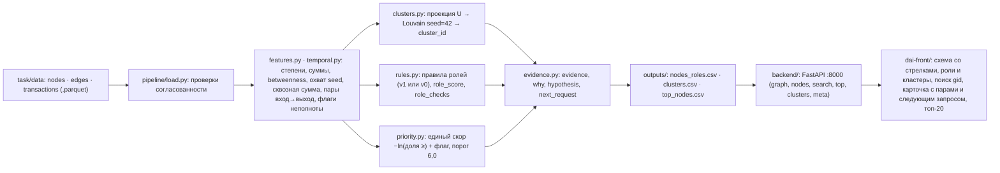

# План выполнения «Граф денег»: остаток дня, 15:40–18:00

> Рабочий план дня хакатона, сохранён как есть. Упоминания папки `handoff/` относятся к запискам между участниками, удалённым перед сдачей; актуальный запуск и проверка — в корневом README.

Время по Asia/Almaty, в скобках T+N минут от старта разработки. Старт 13:00 и сдача 18:00 (T+300) подтверждены владельцем: таймер организаторов в 15:42 показывал 2 ч 17 мин. Пути от корня репозитория `hack-617d5a6a-dai`.

Срез репозитория на 15:32 (T+152), HEAD `f20f674`, до сдачи ≈150 минут. В `main` уже есть: `5e6dcd7` (15:01) — `backend/` с FastAPI на десяти эндпоинтах, заглушка ролей по порогам на настоящих `gid`, контракт `dai-front/openapi.json` и перегенерированный `dai-front/src/client`; `32283c7` (15:12) — `handoff/2026-09-23-din-frontend-contract.md`; `80f0679` (15:16) — `docs/hypothesis_check_2026-09-23.md` и `docs/related_work_2026-09-23.md`, итог в `docs/hypothesis_ivan_din.md`; `f43231e` (15:27) — `scipy==1.16.2` в `backend/requirements.txt`, чистая установка проверена; `f20f674` (15:29) — `backend/__init__.py`, запуск API из корня `uvicorn backend.app.main:app --port 8000`, `backend/export_openapi.py` работает из корня и из `backend/`, блок «Запуск» в `backend/README.md` и в записке Дину. Амир добавил `docs/aml_analyst_ajtbd.md` и `docs/strategy_aml_four_checks.md`: карточка узла = наблюдение + версия + следующий запрос; затык аналитика лежит между осмотром графа и выбором следующего `gid`. Пусто: `pipeline/`, `outputs/`, `Makefile`, корневой `requirements.txt`, Docker-файлы. Демон Docker на машине Ивана не запущен (проверено 15:30).

Дин работает на живой заглушке по записке из `handoff/`. Расхождение с планом одно: для живого API в `dai-front/.env.development` ставится `VITE_MOCKS=false` (записка оставляет `true`; без handlers в `src/mocks/browser.ts` разницы нет, но плашка и поведение не должны зависеть от MSW). Каталог `handoff/` удаляется в 17:30 (§8).

## 1. Цель и принципы

Цель: к 18:00 жюри на чистой машине выполняет команду из README и получает три CSV в `outputs/` меньше чем за 5 минут, затем второй командой открывает экран со схемой сети, ролями, кластерами, поиском по `gid` и карточкой узла. Всё локально, без ключей, GPU и облака.

1. Контракт есть, дальше он только расширяется. Форма ответов `backend/app/schemas.py` заморожена на `5e6dcd7`; поля добавляются с умолчанием, удаление и переименование запрещены (§3.4). Заглушка и настоящая логика отдаются одним кодом API.
2. Один путь данных: три parquet → `python -m pipeline.run` → три CSV в `outputs/` → API читает CSV и parquet → интерфейс. Отдельного `graph.json` нет: API уже строит граф из CSV и parquet за 0,59 с.
3. Пайплайн подменяет заглушку через файлы в `outputs/`: сначала правила v0 (пороги заглушки, но уже из `pipeline/`, кластеры Louvain), затем правила v1 с единым скором. Интерфейс при этом не меняется, меняются значение `meta.method` и текст evidence.
4. Один README, два пути запуска: основной с Docker Compose, запасной без Docker (для CSV нужен только Python 3.11–3.13, для экрана ещё Node ≥ 22.18). Норматив 5 минут относится к пайплайну; сборка образов замеряется и указывается отдельно, команда для CSV собирает только backend-образ.
5. Запасной вариант сдачи готов с 16:10: правила v0 описываются в README как формальные пороги. Стоп-кран 16:50: если v1 не проходит `make check`, сдаём v0.
6. Проверка выходов кодом: `python -m pipeline.check` возвращает ненулевой код при любом нарушении схемы ТЗ; `run.py` вызывает его в конце прогона.

| Участник | Владеет | Файлы, которые меняет только он |
|---|---|---|
| Иван | пайплайн, API, контракт, Docker, воспроизводимый запуск | `pipeline/`, `backend/`, `requirements.txt`, `requirements.lock`, `Makefile`, `scripts/`, `docker/`, `docker-compose.yml`, `.dockerignore`, корневой `.env.example`, `dai-front/openapi.json`, `dai-front/src/client/**` (через генерацию); технические разделы README между маркерами `<!-- ivan -->` |
| Дин | интерфейс, сценарий пользователя, требования к полям API | всё остальное в `dai-front/`, включая `dai-front/README.md` (таблица «Экран / Статус» обновляется в том же коммите, что и экран) |
| Амир | сценарий, приёмка, формулировки скора и порога, README вне технических разделов, питч; код не пишет. Его задачи простыми словами с черновиками текста — `handoff/2026-09-23-amir-tasks.md` (папка удаляется в 17:30) | `README.md` (кроме разделов Ивана), `docs/acceptance.md` |

## 2. Целевая структура репозитория

```text
hack-617d5a6a-dai/
├── README.md                    # единственная инструкция запуска; скелет в §6
├── Makefile                     # обёртки для команды; жюри он не нужен, команды продублированы в README
├── requirements.txt             # все Python-зависимости с ==; backend/requirements.txt ссылается сюда
├── requirements.lock            # pip freeze из venv, где прошёл check (I3); Dockerfile, README и fresh_clone_check ставят -c requirements.lock
├── docker-compose.yml           # pipeline (разовый) → api :8000 → web :8080; web-dev в профиле dev
├── .dockerignore
├── .env.example                 # API_PORT, WEB_PORT, PIPELINE_METHOD; секретов нет
├── docker/
│   ├── Dockerfile.backend       # python:3.11-slim; один образ для pipeline и api
│   ├── Dockerfile.frontend      # node:24-alpine: npm ci → vite build → nginx:1.27-alpine
│   └── nginx.conf               # SPA-фолбэк и /api/ → api:8000/ со снятием префикса
├── pipeline/
│   ├── __init__.py
│   ├── run.py                   # CLI: python -m pipeline.run --data task/data --out outputs [--method v0|v1]
│   ├── load.py                  # загрузка и sanity-check (перенос из backend/app/data.py; логика starter, источник указан)
│   ├── features.py              # степени, суммы, PageRank, betweenness, n_seed_upstream, pass_kzt, даты, флаги
│   ├── clusters.py              # проекция U + Louvain seed=42, разбиение несвязных, cluster_id; одинаково при любом --method
│   ├── temporal.py              # пары вход→выход 1-к-1, статусы хронологии, fast_transit_pairs/flag; API импортирует node_pairs()
│   ├── temporal_check.py        # перестановочный контроль; в основной запуск не входит, таблица идёт в README
│   ├── rules.py                 # THRESHOLDS, ROLE_ORDER, PRIORITY_THRESHOLD_RAW = 6.0; печать таблицы для README
│   ├── roles_v0.py              # пороги заглушки (перенос backend/app/data.py::_mock_role) — запасной вариант сдачи
│   ├── roles_v1.py              # правила I2, role_checks по всем шести ролям
│   ├── priority.py              # v0: ранги PageRank и степени; v1: единый скор из хвостовых долей (§4.3)
│   ├── evidence.py              # evidence, why, hypothesis ≤200 символов с числами; шаблоны next_request
│   ├── export.py                # три CSV (gid int64, атомарная запись) + outputs/run_meta.json
│   ├── check.py                 # проверка выгрузок по §5 и §7 ТЗ; код возврата ≠0 при нарушении
│   ├── metrics.py               # метрики валидации без разметки → outputs/metrics.json (docs/ds_metrics_2026-09-23.md); отдельный модуль
│   └── explain.py               # python -m pipeline.explain <gid>: роль, проверки, вклады скора в терминале (если остаётся время)
├── backend/                     # в main; запуск из корня: uvicorn backend.app.main:app --port 8000
│   ├── __init__.py, README.md, export_openapi.py
│   ├── app/{main.py, schemas.py, data.py}   # data.py импортирует load/features/temporal из pipeline, заглушка-фолбэк остаётся
│   └── requirements.txt         # одна строка: -r ../requirements.txt
├── outputs/
│   ├── nodes_roles.csv, clusters.csv, top_nodes.csv   # коммитится финальный прогон (артефакт §10 ТЗ)
│   └── run_meta.json            # НЕ коммитится: method, elapsed_s, пороги, версии, sha256 входов
├── scripts/fresh_clone_check.sh # проверка сдачи на свежем клоне (I3)
├── handoff/                     # записка Дину; удаляется в 17:30
├── docs/                        # acceptance.md (Амир), этот план, hypothesis_ivan_din.md, temporal_research.md,
│                                # hypothesis_check_2026-09-23.md, related_work_2026-09-23.md, aml_analyst_ajtbd.md, strategy_aml_four_checks.md
├── task/                        # материалы организаторов без изменений
└── dai-front/
    ├── openapi.json             # контракт (генерируется, коммитит Иван)
    ├── src/client/**            # генерация Hey API, не редактировать
    ├── src/routes/index.tsx     # поиск + топ-20 + легенда
    ├── src/routes/nodes.$gid.tsx# карточка узла и его окрестность (gid в path-параметре)
    └── src/components/graph/    # холст графа, легенда, карточка
```

В корневой `.gitignore` дописывается строка `outputs/run_meta.json` (остальное там уже есть: `.venv/`, `__pycache__/`, `node_modules/`, `dist/`, `scratch/`, `.env`, `.env.*` кроме `.env.example`).

Корневой `requirements.txt` повторяет `backend/requirements.txt` (`pandas==2.3.3`, `pyarrow==20.0.0`, `networkx==3.4.2`, `scipy==1.16.2`, `numpy>=1.26,<3`, `fastapi==0.139.0`, `uvicorn==0.44.0`, `pydantic==2.12.5`), а `backend/requirements.txt` становится одной строкой `-r ../requirements.txt`; pip разрешает вложенный `-r` относительно файла, поэтому команда записки `pip install -r backend/requirements.txt` продолжает работать. `scipy` обязателен: `nx.pagerank` в NetworkX 3.4.2 считается через него, без него пайплайн и backend падают на первом вызове (чистая установка проверена в `f43231e`). `numpy` стоит диапазоном только для резолва: у `numpy==1.26.4` нет колёс для Python 3.13. Точные транзитивные версии фиксирует `requirements.lock` из venv, где прошёл `make check` (I3): техпроверка идёт 24–28.09, и незакреплённый пакет может выйти новой версией. У `pyarrow==20.0.0` нет колёс для Python 3.14, поэтому нативный путь требует Python 3.11–3.13 (§5.7).

## 3. Контракт (заморожен на состоянии коммита 5e6dcd7)

### 3.1 Эндпоинты, которые уже есть

FastAPI создан с `generate_unique_id_function=lambda r: r.name`, поэтому имя Python-функции становится именем операции в клиенте Дина. Имена сверены с `dai-front/src/client/@tanstack/react-query.gen.ts`. Все `gid` в JSON строки: все 2 248 значений 18-значные, от `100000000011452100` до `100000008782800100`, больше 2^53.

| Метод и путь | Функция | Ответ | Ошибки | Хук у Дина |
|---|---|---|---|---|
| `GET /health` | `get_health` | `HealthResponse` (`status`, `mock`) | — | `getHealthOptions` |
| `GET /meta` | `get_meta` | `MetaResponse`: `mock`, `source`, счётчики, период, `roles[]` для легенды | — | `getMetaOptions` |
| `POST /reload` | `reload_data` | `ReloadResponse` | — | `reloadDataMutation` |
| `GET /graph?cluster_id=&role=&min_priority=&limit=` | `get_graph` | `GraphResponse`: `nodes[]`, `edges[]` (только между возвращёнными узлами), `meta.truncated` | 422 | `getGraphOptions` |
| `GET /search?q=&limit=` | `search_nodes` | `SearchResponse`: `items[]` (NodeOut), `total` | 422 | `searchNodesOptions` |
| `GET /nodes/{gid}` | `get_node` | `NodeCard`: `node`, `in_edges`, `out_edges`, `transfers[]` с датами | 404 `{"detail": "gid … не найден"}` | `getNodeOptions` |
| `GET /nodes/{gid}/subgraph?radius=1` | `get_node_subgraph` | `GraphResponse` (окрестность 1–3 шага без учёта направления, рёбра направленные) | 404, 422 | `getNodeSubgraphOptions` |
| `GET /top?limit=20` | `get_top_nodes` | `TopResponse`: `items[]` (`rank, gid, role, priority_score, why`) | 422 | `getTopNodesOptions` |
| `GET /clusters` | `list_clusters` | `ClustersResponse`: `items[]` (`ClusterOut`) | — | `listClustersOptions` |
| `GET /clusters/{cluster_id}` | `get_cluster` | `ClusterDetail`: `cluster`, `graph` | 404 | `getClusterOptions` |

Рёбра называются `src`/`dst`, как в parquet и ТЗ. Библиотека графа ждёт `source`/`target` — адаптер одна функция в `src/components/graph/`, контракт под библиотеку не подстраивается.

Источник данных API: если в `outputs/` лежат все три CSV, `source="outputs"` и `mock=false`; иначе заглушка `source="mock"`, `mock=true`. Заглушка остаётся в коде до сдачи как страховка демо; README говорит, что пайплайн запускается первым, Compose обеспечивает порядок сам.

### 3.2 Расширения контракта по итерациям (все аддитивные)

| Итерация | Поле | Тип и умолчание | Откуда |
|---|---|---|---|
| I1 | `MetaResponse.method` | `str \| None = None`: `"v0"`, `"v1"`; `None` для заглушки и для CSV без `run_meta.json`. Метод относится к правилам ролей и приоритету; кластеры при любом методе Louvain | `outputs/run_meta.json` |
| I1 | `MetaResponse.elapsed_s` | `float \| None = None` | `run_meta.json` |
| I1 | `NodeOut.betweenness` | `float \| None = None` | колонка `nodes_roles.csv` |
| I1 | `NodeOut.n_seed_upstream` | `int \| None = None`: от скольких seed узел достижим по направленным путям | колонка |
| I1 | `NodeOut.flags` | `list[str] = []`: `depth4_boundary`, `seed_inflow_incomplete`, `isolated`; с I2 `fast_transit`, `also:<role>` | колонка `flags` через `;` |
| I2 | `MetaResponse.thresholds` | `dict[str, float] = {}`: пороги ролей, `priority_threshold_raw` (6,0) и `priority_threshold` в шкале 0–1 | `pipeline/rules.py` через `run_meta.json` |
| I2 | `NodeOut.priority_raw` | `float \| None = None`: скор до нормировки, в тех же единицах, что порог 6,0 | колонка |
| I2 | `NodeOut.score_terms` | `list[ScoreTerm] = []`, `ScoreTerm(feature, value, percentile, contribution)`, по убыванию вклада; первые два идут в evidence | колонки `term_<feature>` |
| I2 | `NodeOut.fast_transit_pairs` | `int \| None = None` | колонка |
| I2 | `NodeCard.role_checks` | `list[RoleCheck] = []`, `RoleCheck(role, passed, score, detail)` | колонки `check_<role>` |
| I2 | `NodeCard.pairs` | `list[TransferPair] = []`, `TransferPair(in_date, out_date, in_sum, out_sum, lag_days, chronology_status, matched_1to1)`; `chronology_status` ∈ {«вход раньше выхода», «тот же день, порядок неизвестен», «выход раньше входа»} | `pipeline/temporal.py::node_pairs`, считается API на лету из transactions (38 311 пар за 0,006 с) |
| I2 | `NodeCard.limitations` | `list[str] = []`: текст ограничений наблюдения для узла | из `flags` |
| I2 | `NodeCard.next_request` | `str \| None = None`: следующий запрос данных по шаблонам Амира (§4.3) | `pipeline/evidence.py` |

`backend/app/data.py::_load_outputs` берёт из `nodes_roles.csv` обязательные шесть колонок и любые из известного списка дополнительных, если они есть: v0 без `priority_raw` и v1 с ним читаются одним кодом. После каждой правки схемы: `python backend/export_openapi.py`, затем `cd dai-front && npm run gen && npm run typecheck`; `openapi.json` и `src/client` коммитятся вместе с backend.

Поведение, которое меняется без смены схемы: `search_nodes` в I1 ищет подстроку. У всех 2 248 `gid` одинаковые первые восемь символов `10000000`, поэтому поиск по началу возвращает всё, пока не набран почти весь идентификатор. Точное совпадение по-прежнему идёт первым.

### 3.3 Обязательные CSV

Обязательные колонки идут первыми в порядке ТЗ; дополнительные справа.

| Файл | Обязательные колонки | Дополнительные | Инварианты (проверяет `pipeline/check.py`) |
|---|---|---|---|
| `nodes_roles.csv` | `gid` (int64), `role`, `role_score`, `cluster_id`, `priority_score`, `evidence` | `is_seed, depth, in_deg, out_deg, in_kzt, out_kzt, in_tx, out_tx, pass_kzt, truncated_by_depth, betweenness, n_seed_upstream, flags`; с I2 `priority_raw, fast_transit_pairs, term_<feature>, check_<role>` | число строк равно числу строк `nodes.parquet`; множество `gid` совпадает; `gid` читается как int64 без дублей; роль из словаря; оба score в [0, 1] без NaN; `cluster_id` целый; `evidence` непустой, ≤200 символов, содержит цифру, без перевода строки; префикса `mock` нет |
| `clusters.csv` | `cluster_id, n_nodes, n_seed, sum_kzt_internal, top_gids, hypothesis` | `n_edges_internal, share_depth4` | сумма `n_nodes` равна числу узлов, сумма `n_seed` равна числу seed из parquet; множество `cluster_id` совпадает с `nodes_roles`; `top_gids` через `;`, каждый есть в узлах; `hypothesis` непустая |
| `top_nodes.csv` | `rank, gid, role, priority_score, why` | `cluster_id, priority_raw` | ≥20 строк (пишем 50); `rank` = 1..N; `priority_score` не возрастает; `gid` и `role` совпадают с `nodes_roles`; `why` непустой |

Ожидаемые числа `check.py` берёт из parquet (`len(nodes)`, `nodes.is_seed.sum()`), не из констант. Запись: `role_score` и `priority_score` округлены до 4 знаков, суммы до 2, `lineterminator="\n"`, `gid` перед записью `astype("int64")` (после `merge` с пропусками pandas превращает колонку во float, и в файл уходит `1.0000000001e+17`). Файлы пишутся во временный файл рядом и переименовываются через `os.replace`, чтобы API не прочитал недописанный CSV во время живого прогона. При тех же входах повторный прогон даёт побайтно те же файлы.

Флаг `--require-method v1` заставляет `check.py` падать, если evidence хоть одной строки начинается с `v0:` или если `run_meta.json` есть и содержит другой метод. Отсутствие `run_meta.json` не ошибка: закоммиченные CSV проверяются на свежем клоне без него. Флаг — гейт команды (Makefile, `fresh_clone_check.sh`), в команды README для жюри не входит: при стоп-кране 16:50 сдаётся v0.

### 3.4 Правила эволюции контракта

1. Добавлять можно поле с умолчанием, новый эндпоинт, новый query-параметр с умолчанием. Удалять, переименовывать, менять тип (gid всегда строка) и расширять словарь `Role` нельзя. Уточнения роли идут в `flags`.
2. Имена функций эндпоинтов не меняются: от них зависят `getXxxOptions` и ключи запросов.
3. Контракт меняет только Иван, одной командой и одним коммитом `contract: +<поле>`:

```bash
make contract     # python backend/export_openapi.py && cd dai-front && npm run gen && npm run typecheck
git add dai-front/openapi.json dai-front/src/client && git commit -m "contract: +method в MetaResponse" && git push
```

4. Дин после `git pull` получает готовый `src/client`; непушнутую правку с работающего сервера Ивана берёт так: `cd dai-front && curl -o openapi.json http://<IP-Ивана>:8000/openapi.json && npm run gen && npm run typecheck`.
5. Дин просит поле сообщением «нужно поле X в Y, тип, пример значения, зачем на экране». Иван добавляет его в течение 15 минут или сразу называет срок.
6. Смена логики внутри `pipeline/` меняет значения и `meta.method`, схему не трогает.

### 3.5 Что нужно экрану и как это кодировать (решает Дин)

| Что видит аналитик | Поле | Предлагаемое кодирование |
|---|---|---|
| направление денег | `EdgeOut.src → dst` | стрелка на конце, изогнутые рёбра (177 встречных пар не сливаются) |
| объём пары | `sum_kzt`, `n_tx` | толщина по log(sum_kzt), подсказка при наведении |
| роль | `NodeOut.role`, `role_score` | цвет по роли и слово рядом, легенда из `/meta.roles` |
| кластер | `cluster_id` | обводка; переключатель «цвет по роли / по кластеру». После Louvain кластеров 91: цвет у 8 крупнейших из `/clusters` (сортировка по `n_nodes`), остальные серые; номер кластера в подсказке и карточке |
| приоритет и порог | `priority_score`, `priority_raw`, `meta.thresholds.priority_threshold`, место в `/top` | размер узла; в карточке «скор 8,4, порог 6,0» и два вклада из `score_terms`; ранг — `Map<gid, rank>` из `getTopNodesOptions({ query: { limit: 50 } })` на клиенте |
| seed | `is_seed` | ромб |
| граница выгрузки | `truncated_by_depth`, `flags` | пунктирная обводка у `depth4_boundary` |
| почему такая роль | `evidence`, с I2 `role_checks`, `limitations` | карточка справа |
| пары переводов и следующий запрос | `NodeCard.pairs`, `next_request` | список пар с датами, суммами и статусом хронологии; `next_request` отдельной строкой под evidence |
| источник данных | `meta.mock`, `meta.method` | плашка в шапке: «заглушка» при `mock`, «правила v0» при `method="v0"`, «метод не записан: запустите пайплайн» при `mock=false` и `method=null`; при `v1` плашки нет. Отдельно `useQuery(getHealthOptions())`: ошибка → «backend недоступен, проверь :8000» |

Выбранный узел живёт в path-параметре `/nodes/$gid` (файл `src/routes/nodes.$gid.tsx`). Search-параметр не подходит: TanStack Router прогоняет значения `?gid=…` через `JSON.parse`, и ссылка `?gid=100000000011452100` превращается в число с потерей последних цифр. Фильтр по кластеру можно держать в search как число.

## 4. Итерации

### 4.0 Кто что делает

| Окно | Иван | Дин | Амир |
|---|---|---|---|
| 15:40–16:10 (I1) | `pipeline/` v0: загрузка, признаки, Louvain, betweenness, `check.py`, три CSV, `POST /reload`; контракт `+method,+elapsed_s,+betweenness,+n_seed_upstream,+flags`; Makefile, корневой `requirements.txt`. Коммит 16:00 | экран `/nodes/$gid` на живой заглушке: поиск, окрестность со стрелками, карточка с evidence; плашки `mock` и «backend недоступен». Коммит 16:00 | формулировки скора и порога 6,0 для README и карточки; `docs/acceptance.md`: сценарий и пять контрольных `gid` по правилу |
| 16:10–16:50 (I2) | правила v1, единый скор, evidence, `temporal.py` (флаг быстрого транзита, пары для карточки), `next_request`; контракт I2; `--method v1` по умолчанию; в 16:10 `open -a Docker` в фоне. Стоп-кран 16:50 | топ-20 с переходом, список кластеров, карточка с `role_checks`, парами и `next_request`; плашка исчезает при `method="v1"`. Обновить `dai-front/README.md` | шаблоны `next_request` к 16:20; приёмка пяти `gid` через экран; скелет README по §6 |
| 16:50–17:30 (I3) | Docker-файлы §5, `requirements.lock`, `fresh_clone_check.sh`, технические разделы README, mermaid-схема; таблица устойчивости, если остаётся время. Коммит 17:00 | пустые и ошибочные состояния, `make web-check`, `docker compose build web`. Коммит 17:00 | README «Что реализовано», «Как проверить», «Ограничения»; сценарий демо на 5 минут; абзац о перестановочном контроле |
| 17:30–18:00 (I4) | 17:30 заморозка; финальный прогон, коммит CSV, `git rm -r handoff/`; починка по итогам свежего клона; 17:50 push | `make web-check` на сдаваемой версии; проверка интерфейса на свежем клоне | 17:10–17:40 свежий клон по README (§8); 18:00 «Сдать решение», хеш в `acceptance.md` |

Синки по 10 минут на границах окон: 15:40, 16:10, 16:50, 17:30. Договорённость команды: с 16:30 (T+210) новые функции не начинаются, начатое в I2 доводится до 16:50, дальше только Docker, README и починка. Коммит и push каждого не реже раза в час: 16:00, 17:00, финальный 17:50; незавершённое с префиксом `WIP:`. Перед коммитом `git pull --rebase --autostash` (правило корневого `CLAUDE.md`).

### 4.1 I0 — выполнена

Контракт и живая заглушка для экрана: `5e6dcd7` (backend на десяти эндпоинтах, `openapi.json`, `src/client`), `32283c7` (записка Дину), `f43231e` (`scipy==1.16.2`), `f20f674` (`backend/__init__.py`, запуск из корня, `export_openapi.py` из обоих мест, блок «Запуск» в `backend/README.md` и записке). Дин получил контракт и работает на заглушке; Swagger на `http://localhost:8000/docs`.

Как Дин получает API (из корня репозитория, Python 3.11–3.13):

```bash
python3 -m venv .venv && .venv/bin/pip install -r backend/requirements.txt
.venv/bin/uvicorn backend.app.main:app --port 8000      # source=mock, пока outputs/ пуст
cd dai-front && printf 'VITE_API_URL=/api\nVITE_MOCKS=false\n' > .env.development && npm run dev   # прокси на localhost:8000
# Б. backend Ивана по сети (если Wi-Fi площадки не изолирует клиентов): Иван запускает с --host 0.0.0.0 и пишет IP
#    из `ipconfig getifaddr en0`; Дин проверяет curl http://<IP-Ивана>:8000/health, затем
#    VITE_MOCKS=false API_PROXY_TARGET=http://<IP-Ивана>:8000 npm run dev
```

Хвост I0 уходит в первый коммит I1: корневой `requirements.txt` и `backend/requirements.txt` → `-r ../requirements.txt`, `Makefile` (§5.6), строка `outputs/run_meta.json` в `.gitignore`.

Правила v0 повторяют заглушку `backend/app/data.py::_mock_role` (сверху вниз, первое сработавшее правило даёт роль): coordinator при `in_deg ≥ 3` и `out_deg ≥ 5`; distributor при `out_deg ≥ 10`; consolidator при `in_deg ≥ 3`; transit при входе и выходе и `0,8 ≤ out_kzt/in_kzt ≤ 1,2`; terminal при входе, `out_deg = 0` и `depth < 4`; иначе peripheral. Прогон на данных кейса (23.09, 0,59 с вместе с загрузкой): terminal 1042, peripheral 922, consolidator 143, transit 57, coordinator 57, distributor 27. Число terminal завышено, coordinator по одному сочетанию степеней — это пересматривает I2. Приоритет v0: 0,5·ранг PageRank + 0,4·ранг суммарной степени + 0,1·seed. Evidence v0 с префиксом `v0:` и числами: `v0: in_deg=24, out_deg=62, in_kzt=3,848,436, out_kzt=8,588,655, depth=0, seed=1`.

Контрольные `gid` Амира выбираются правилом, без подбора под ответ; в коде списков `gid` нет. Значения проверены по parquet 23.09:

| Правило выбора | `gid` | Факт из данных | Ожидание |
|---|---|---|---|
| максимальный `in_deg` | `100000003684369100` | 24 плательщика и 62 получателя, seed, depth 0 | роль по опубликованному порядку (distributor или coordinator); evidence называет 24 и 62 |
| максимальный `out_deg` | `100000002578405100` | 116 получателей, 2 плательщика, depth 2 | distributor; evidence называет 116 |
| `in_deg ≥ 6` при `out_deg ≤ 1`, первый по `gid` | `100000002398779100` | 13 плательщиков, 1 получатель, depth 2, не seed | consolidator; evidence называет 13 |
| seed без рёбер, первый по `gid` | `100000000456947100` | 0 входящих и 0 исходящих | peripheral, флаг `isolated`, свой одноузловой кластер, evidence «нет наблюдений» |
| depth 4 без исходящих, первый по `gid` | `100000000018102100` | 1 плательщик, 0 получателей, depth 4 | не terminal; флаг `depth4_boundary` |

CSV открывать в текстовом редакторе или через экран: Excel и Numbers показывают 18-значный `gid` как `1E+17`.

### 4.2 I1 — пайплайн v0 с кластерами и признаками, экран на живом API (15:40–16:10, T+160…T+190)

Цель: к 16:10 `pipeline.run --method v0` пишет три валидных CSV с кластерами Louvain, `POST /reload` переключает API на `source="outputs"`, экран Дина (поиск → окрестность → карточка) работает против живого API.

Иван (метод зафиксирован в исследовательских заметках вне репозитория; код пишется здесь заново):

1. Перенос из `backend/app/data.py`: `_load_raw`, `_build_graph`, `_features` → `load.py`, `features.py`; `_mock_role`, `_mock_evidence`, `_mock_clusters`, `_mock_outputs` → `roles_v0.py`, `evidence.py`, `priority.py`. `data.py` импортирует их обратно, заглушка-фолбэк продолжает работать.
2. `clusters.py`. Проекция U строится явно: вес пары равен `sum_kzt(A→B) + sum_kzt(B→A)`; `to_undirected()` оставил бы одно направление в каждой из 177 встречных пар и потерял часть оборота (31,65 млн KZT в замере 23.09). Контроль: сумма весов U равна сумме весов G (365 890 012 KZT), 2 942 пары; все 2 248 узлов добавлены в U явно. `nx.community.louvain_communities(U, weight="sum_kzt", resolution=1.0, seed=42)` (замер 23.09: 0,04 с, 91 сообщество с изолятами). Несвязные сообщества разделяются по `connected_components`, каждый изолят получает свой кластер, `cluster_id` по (−размер, минимальный `gid`). Число кластеров под «8 из ТЗ» не подгоняется. Кластеры одинаковы при любом `--method`: флаг управляет только правилами ролей и приоритетом.
3. `features.py`: `nx.betweenness_centrality(G, weight=None, normalized=True)` точно, без `k` (замер 23.09: 1,0 с); `n_seed_upstream` (`nx.descendants` от каждого из 81 seed); `pass_kzt = min(in_kzt, out_kzt)` для глубин 1–3, у 444 узлов глубины 4 и у seed без рёбер — 0; `first_date`/`last_date` из transactions; флаги `depth4_boundary` (444 узла), `seed_inflow_incomplete` (81 seed), `isolated` (19 узлов).
4. `run.py` с `--method v0`, `export.py`, `check.py` по §3.3, `make determinism` (два прогона в `scratch/`, `cmp` по трём CSV). Кластеры v0 в заглушке были компонентами (35 штук: 16 с рёбрами, крупнейшая 1 877 узлов, 19 изолятов); с этого коммита и в v0 они Louvain.
5. `search_nodes` → подстрока; `MetaResponse.method`, `elapsed_s`, `NodeOut.betweenness`, `n_seed_upstream`, `flags` (§3.2); `make contract`. Коммит 16:00: `pipeline: v0 + louvain + features, contract: +method,+elapsed_s,+betweenness,+n_seed_upstream,+flags`.

Дин: маршрут `src/routes/nodes.$gid.tsx` на `getNodeSubgraphOptions({ path: { gid }, query: { radius: 1 } })` и `getNodeOptions`; `radius` по умолчанию 1, переключатель до 2 (у `100000003684369100` radius 1/2/3 даёт 86/250/802 узла, у `100000002578405100` — 117/158/269); при `meta.n_nodes > 400` раскладка вокруг выбранного узла и подпись с числом узлов; кластер больше 400 узлов открывать списком `top_gids`. Левая панель (поиск + топ-20) в `__root.tsx`; `/` показывает подсказку «введите gid или выберите из топа». Поиск: введено 18 цифр → сразу `navigate({ to: '/nodes/$gid', params: { gid: q } })`; иначе `searchNodesOptions({ query: { q, limit: 20 } })` с `enabled: q.length >= 6` и debounce 250 мс; при `items.length === 0` показывать «gid не найден» и `total`. На `/nodes/$gid`: `getNodeOptions` и `getNodeSubgraphOptions` с `retry: false, meta: { silent: true }` (умолчание `retry: 1` в `query-client.ts` откладывает 404 на секунду, глобальный тост не нужен); 404 → блок «gid … не найден» на месте холста; `isPending` → `Skeleton`. Плашка «backend недоступен» по `getHealthOptions`: Vite-прокси при лежащем backend отвечает 500 с пустым телом, и `getErrorMessage` даёт «Что-то пошло не так». Холст без обёртки: `useRef` + `useEffect` с уничтожением экземпляра в cleanup, иначе StrictMode в `main.tsx` смонтирует два холста. Перед каждым push `make web-check`: сломанная сборка в main ломает сборку образа.

Амир: формулировки скора и порога (шаблон README «вклад = −ln(доля узлов с не меньшим значением), порог 6,0 = два признака выше P95»); `docs/acceptance.md`: обязательный сценарий («жюри называет `gid` → аналитик вводит его → видит роль, числа evidence, входящие и исходящие связи со стрелками → открывает топ-20 и переходит к узлу → за минуту объясняет три узла по числам»), пять контрольных `gid` из таблицы §4.1 с ожидаемым поведением экрана.

Definition of Done I1:

```bash
make pipeline METHOD=v0 && make check                    # OK, код 0; печатает узлы по ролям и число кластеров
wc -l outputs/nodes_roles.csv                            # 2249 (заголовок + 2 248)
make determinism                                         # determinism: OK
curl -s -X POST localhost:8000/reload                    # {"source":"outputs","n_nodes":2248}
curl -s localhost:8000/meta | python3 -c "import sys,json; m=json.load(sys.stdin); print(m['source'], m['mock'], m['method'], m['n_clusters'])"   # outputs False v0 91
curl -s 'localhost:8000/search?q=8102100' | head -c 200   # подстрока находит 100000000018102100
curl -s -o /dev/null -w '%{http_code}\n' localhost:8000/nodes/1   # 404
cd dai-front && npm run typecheck                        # зелёный на новом контракте
# браузер, http://localhost:5173 с VITE_MOCKS=false: ввести 100000002578405100 → окрестность со стрелками, карточка с evidence
# вставить в адресную строку http://localhost:5173/nodes/100000000011452100 → в карточке тот же gid без искажения
```

### 4.3 I2 — правила v1, единый скор, временной слой (16:10–16:50, T+190…T+230)

Цель: к 16:50 обязательный сценарий работает на правилах v1, `meta.method = "v1"`, у каждого узла один скор с объяснимым порогом, в карточке пары переводов и следующий запрос; Амир объясняет контрольные `gid` по числам на экране за минуту каждый.

В 16:10 Иван одной командой запускает демон Docker в фоне (§5.1), чтобы к 16:50 он был поднят и базовые образы скачаны.

Роли v1 (`rules.py`, `roles_v1.py`). Словарь ТЗ и `role_score` остаются отдельной шкалой от приоритета. Ориентиры квантилей: `in_deg` P90/P95/P99 = 2/3/6, `out_deg` = 3/5/23,53. Пороги сверяются с распределениями, которые печатает `make check`, и после 16:50 меняются только с записью причины в README.

| Порядок | Роль | Правило v1 (все условия) | role_score |
|---|---|---|---|
| 1 | coordinator | `n_seed_upstream ≥ 2`; `betweenness ≥ P99` или межкластерных рёбер ≥ 2; `out_deg ≥ 2` | среднее по min(1, метрика / сильный порог) |
| 2 | distributor | `out_deg ≥ 10`, или `out_deg ≥ 5` и доля крупнейшего получателя ≤ 0,3 | min(1, out_deg / 23,53) с поправкой на `out_tx` |
| 3 | consolidator | `in_deg ≥ 6`, или `in_deg ≥ 3` и `in_kzt ≥ P90` среди узлов с входом | среднее по насыщению `in_deg` и `n_seed_upstream` |
| 4 | transit | вход и выход есть; не seed; `0,8 ≤ out_kzt/in_kzt ≤ 1,2`; `fast_transit` подтверждает роль, но не назначает её | `1 − abs(out_kzt/in_kzt − 1) / 0,2` |
| 5 | terminal | вход есть; `out_deg = 0`; `depth < 4` | не выше 0,6: отсутствие выхода не доказывает удержание |
| 6 | peripheral | ни одно правило не сработало; у изолятов флаг `isolated`, у 444 узлов 4-го колена без выхода `depth4_boundary` | `1 − max(score других правил)` |

Сработавшие роли кроме основной идут в `flags` как `also:<role>`; `role_checks` по всем шести ролям пишутся в колонки `check_<role>`. Имена типологий в evidence: consolidator — fan-in, distributor — fan-out, coordinator — gather-scatter, transit — звено scatter-gather.

Единый скор (`priority.py`, блок 1 из `docs/related_work_2026-09-23.md`; замечание владельца: аналитику понятнее один скор и порог, чем много классов):

- Признаки: `in_kzt`, `out_kzt`, `in_deg`, `out_deg`, `betweenness`, `pass_kzt`. Для признака j и значения x хвост `p_j(x)` = доля узлов со значением ≥ x (равные включаются; нулевое значение даёт p = 1 и вклад 0, поэтому связки рангов на нулях скор не завышают). У 444 узлов глубины 4 исходящие признаки и `pass_kzt` дают вклад 0.
- `priority_raw = Σ_j −ln p_j(x_j) + 1,0 · fast_transit_flag`. Вклад одного признака ограничен сверху ln 2248 ≈ 7,7. Порог 6,0 = 2·(−ln 0,05) читается как «два признака выше P95» (или один выше P99,75); флаг с весом 1,0 равен одному признаку на уровне P63 и порог сам не преодолевает.
- Шкала CSV и API: `priority_score = priority_raw / max(priority_raw)`, порог в той же шкале `priority_threshold = 6,0 / max(priority_raw)`; оба числа и `priority_threshold_raw = 6,0` пишутся в `run_meta.json` и отдаются в `meta.thresholds`. `top_nodes.csv` пишет 50 строк по убыванию скора независимо от порога.
- `evidence` v1 ≤200 символов: роль с типологией и числами, затем скор с двумя наибольшими вкладами (значение и перцентиль), затем флаг. Образец: `distributor (fan-out): 23 получателя, 41,2 млн KZT исходящих; скор 8,4 (порог 6,0): сквозная сумма 41,2 млн (P99), 23 получателя (P98); быстрый транзит: 3 пары за 0–2 дня`. `why` в топе равен evidence. `hypothesis` кластера: «N узлов, S seed, V KZT внутреннего оборота; признаки консолидации у X; веерный выход у Y; B узлов на границе выгрузки». Все формулировки как гипотезы для проверки.

Временной слой (`temporal.py`), только по решениям `docs/hypothesis_check_2026-09-23.md`:

- Пары «вход A→B, выход B→C» при A ≠ C, лаг `day_out − day_in ∈ {0, 1, 2}`, отношение сумм `out/in ∈ [0,8; 1,2]`; сопоставление 1-к-1 жадное: пары сортируются по |отношение − 1|, затем по |лагу|, каждая операция входит не больше чем в одну пару. `fast_transit_pairs` — число таких пар, `fast_transit_flag = (fast_transit_pairs ≥ 2)`; на данных кейса флаг у 54 узлов из 671 с входами и выходами против 34–38 при перестановочном контроле (p ≤ 0,002). Флаг входит в скор весом 1,0 и в `flags` как `fast_transit`.
- Три статуса хронологии на паре («вход раньше выхода», «тот же день, порядок неизвестен», «выход раньше входа») отдаются в `NodeCard.pairs` без веса в скорах; `node_pairs(tx, gid)` в `temporal.py` одна и та же для пайплайна и API. Мотив «выход раньше входа» в скор не входит, второго рейтинга нет.
- `pipeline/temporal_check.py`: 1 000 перестановок дат глобально и внутри отправителя для статистик «узлы с ≥2 парами Δ<0, Δ=0, Δ ∈ [1; 2]» и для быстрого транзита; печатает таблицу «статистика — наблюдаемое — среднее контроля — p — тип нуля» (≈1 с). В `run.py` не входит; таблица идёт в README, абзац простыми словами пишет Амир по черновику из записки. Последний пункт I2: при нехватке времени снимается первым, README тогда называет числа проверки 23.09 и говорит, что она выполнена вне репозитория.
- Слова «возмещение», «аванс», «нелинейное время» в evidence, `limitations`, `next_request` и интерфейсе не используются.

`next_request` (`evidence.py`, шаблоны Амира к 16:20; закрывает пункт «Оценка полноты» из §8 ТЗ). Строка выбирается первым сработавшим правилом: `depth4_boundary` → «запросить исходящие переводы за июль 2026: в выгрузке их нет по построению»; seed → «запросить входящие переводы: выгрузка содержит только исходящие»; пара со статусом «выход раньше входа» → «запросить остаток счёта посредника до раннего платежа и полную историю поступлений»; `fast_transit` → «запросить назначения платежей и остатки на даты пар вход→выход»; иначе → «запросить контрагентов вне выгрузки по крупнейшей паре». `limitations` собирается из `flags` тем же способом.

Контракт I2 (§3.2) одним коммитом `contract: +thresholds,+priority_raw,+score_terms,+fast_transit_pairs,+role_checks,+pairs,+limitations,+next_request`; `--method v1` становится умолчанием в `run.py`, `Makefile` (`METHOD ?= v1`) и Compose тем же коммитом. `explain.py` пишется, если остаётся время; иначе объяснение произвольного `gid` идёт по карточке.

Дин: панель топ-20 из `getTopNodesOptions` с переходом на `/nodes/$gid`; список кластеров из `listClustersOptions` и подграф из `getClusterOptions`; переключатель цвета «роль / кластер»; карточка с `role_checks`, флагами, `limitations`, скором и порогом, списком `pairs` и строкой `next_request`; плашка исчезает сама при `method="v1"`. Обновить `dai-front/README.md`.

Амир: шаблоны `next_request` к 16:20 сообщением Ивану; приёмка пяти контрольных `gid` через экран, запись фактических ролей и чисел в `acceptance.md` в формате «gid, ожидал, получил, какое правило»; проверка формулировок на «гипотеза для проверки»; скелет README по §6 (заголовки; «Коротко», «Проблема и для кого», «Ограничения» текстом).

Definition of Done I2:

```bash
time make pipeline                                       # wall-time; ожидаемо единицы секунд
make check ARGS="--require-method v1" && make determinism
curl -s localhost:8000/meta | python3 -c "import sys,json; m=json.load(sys.stdin); print(m['method'], m['mock'], m['thresholds'])"   # v1 False {…priority_threshold_raw: 6.0…}
curl -s localhost:8000/nodes/100000002398779100 | python3 -c "import sys,json; c=json.load(sys.stdin); print(c['node']['evidence']); print(len(c['pairs']), c['next_request'])"
git add outputs/*.csv && git commit -m "outputs: rules v1"
```

Проверка экрана (Дин и Амир, http://localhost:5173, `VITE_MOCKS=false`): каждый из пяти контрольных `gid` находится поиском; видны стрелки, цвет по роли, обводка кластера, evidence, скор с порогом, пары и `next_request` в карточке; плашки нет; переход из топа ведёт к узлу; несуществующий `gid` даёт сообщение без белого экрана.

Стоп-кран 16:50 (T+230): если v1 не проходит `make check` или правила не объясняются по числам, в сдачу идёт v0 одним коммитом: `--method v0` по умолчанию в `run.py`, `METHOD ?= v0` в Makefile, `PIPELINE_METHOD=v0` в `.env.example`, умолчание `${PIPELINE_METHOD:-v0}` в `docker-compose.yml`; Louvain остаётся, префикс `v0:` в evidence снимается, README описывает пороги v0 таблицей из `python -m pipeline.rules --markdown`; coordinator в v0 называется «кандидат по степеням, посредничество не проверялось». Команды README для жюри не меняются. Если и обязательный сценарий на реальных данных не работает, всё опциональное снимается; помощь идёт в общий блокер, владельцы участков не меняются.

### 4.4 I3 — Docker, README, схема, свежий клон (16:50–17:30, T+230…T+270)

Цель: `docker compose run --rm pipeline` на чистом клоне даёт CSV, `docker compose up --build` даёт экран на `http://localhost:8080` с реальными данными; README закрывает §10 ТЗ.

Иван, 16:50–17:10: `docker info` — если демон, запущенный в 16:10, не поднялся, Docker-путь снимается (ниже). После зелёного `make check` в чистом venv — `.venv/bin/pip freeze --exclude-editable > requirements.lock`, коммит; `Dockerfile.backend`, README и `fresh_clone_check.sh` ставят `-r requirements.txt -c requirements.lock`. Файлы §5.2–5.5, `scripts/fresh_clone_check.sh` (§8), `make up`, замеры `time docker compose build` (холодный кэш) и `time docker compose run --rm pipeline`; оба числа с условиями (машина, архитектура, сеть) в README. В фоне сборка и прогон под amd64 для проверки архитектуры жюри (под эмуляцией медленно, результат к 17:30):

```bash
(docker buildx build --load --platform linux/amd64 -f docker/Dockerfile.backend -t dai-backend:amd64-check . \
 && docker run --rm --platform linux/amd64 -v "$PWD/task/data:/app/task/data:ro" -v "$PWD/scratch/amd64-out:/app/outputs" dai-backend:amd64-check python -m pipeline.run --data /app/task/data --out /app/outputs \
 && docker buildx build --platform linux/amd64 -f docker/Dockerfile.frontend -t dai-web:amd64-check .) > scratch/amd64-build.log 2>&1 &
```

После прогона `cmp scratch/amd64-out/nodes_roles.csv outputs/nodes_roles.csv`; расхождение с arm64 записывается в `acceptance.md`, и README не утверждает побайтного совпадения на любой машине.

Иван, 17:10–17:30: технические разделы README (запуск, критерии и пороги из `rules.py` между маркерами `<!-- rules:begin -->`/`<!-- rules:end -->`, скор и порог, временной слой, выходы, масштабирование, раскрытие по п. 6.4), mermaid-схема прямо в README. Из §8 ТЗ в сдачу входит только то, что уже посчитано в проверках: учёт обрыва на 4-м колене (флаг `depth4_boundary`, 444 узла; контрпример из исследования: искусственный обрыв на глубине 3 превратил 284 узла с видимыми исходящими в «стоки»), быстрый транзит (флаг и пары), следующий запрос (`next_request`) и устойчивость при изъятии топ-N: таблица «удалили топ-10/20/50 → размер крупнейшей слабой компоненты и остаток оборота» против случайного удаления (20 повторов, seed 42), betweenness и оборота. Базовые числа замерены 23.09: исходная компонента 1 877 узлов; по betweenness LCC 1 567 / 1 257 / 921 и остаток оборота 85,2 / 75,7 / 66,1 %; по обороту 1 466 / 1 376 / 1 034 и 71,4 / 62,3 / 43,7 %; случайно медиана LCC 1 866 / 1 848 / 1 790. Колонка для нашего скора считается после I2 (<2 с) и добавляется, если остаётся время; без неё таблица в README не публикуется. Раскладка всего графа, временной статус маршрутов, детекция аномалий и AI-ассистент не делаются.

Если Docker к 16:50 не поднялся или `docker compose run --build --rm pipeline` не прошёл на машине Ивана к 17:30: основной путь в README становится нативным (§5.7, блок без Docker), Docker-файлы из `main` удаляются, чеклист §8 идёт только по нативному пути. README описывает только то, что проверено.

Дин: пустые и ошибочные состояния, легенда ролей и кластеров, `npm run build` и `npm run lint` без ошибок, сборка своего кода внутри образа (`docker compose build web`).

Амир: разделы README «Что реализовано» (таблица пяти must-have: пункт → файл или экран → как проверить; отдельно вошедшие опциональные), «Как проверить», «Ограничения»; абзац о перестановочном контроле с таблицей из `temporal_check.py`; сценарий демо на 5 минут (живой прогон, поиск `gid`, разбор 2–3 узлов по карточке: роль, скор против порога, пары, следующий запрос).

Definition of Done I3:

```bash
docker compose down && rm -f outputs/*.csv outputs/run_meta.json
time docker compose build                                # замер сборки, в README с условиями
time docker compose run --rm pipeline                    # печатает elapsed_s и OK
docker compose up -d && docker compose ps -a             # pipeline Exited (0), api healthy, web Up
curl -s localhost:8080/api/health                        # {"status":"ok","mock":false}
open http://localhost:8080                               # схема, поиск gid, карточка, топ-20
cd dai-front && npm run build && npm run lint
```

### 4.5 I4 — заморозка и сдача (17:30–18:00, T+270…T+300)

| Когда | Кто | Действие |
|---|---|---|
| 17:10–17:40 (T+250) | Амир | свежий клон по README как пользователь (§8); Дин проверяет интерфейс, Иван чинит сборку и окружение |
| 17:30 (T+270) | все | заморозка: незавершённое убирается из main или скрывается за флагом, выключенным по умолчанию |
| 17:30–17:45 | Иван | финальный прогон, `make check determinism`, коммит CSV, сверка таблицы порогов README с `python -m pipeline.rules --markdown`, числа времени в README, `git rm -r handoff/` |
| 17:30–17:45 | Дин | `make web-check`, экраны ошибок на сдаваемой версии |
| 17:45 | Амир | README полный, `acceptance.md` с фактическими результатами |
| 17:50 (T+290) | все | все изменения запушены; Иван проверяет `git log origin/main -1` |
| 18:00 (T+300) | Амир | «Сдать решение» на платформе, хеш коммита в `acceptance.md` |

## 4.6 Выкат 16:30–18:00 (по таймеру организаторов 16:25 = 1 ч 35 мин до сдачи)

Docker из сдачи снят: DNS на площадке ненадёжен, сборка образов не проверяется, README описывает только нативный путь (Python 3.11–3.13, Node ≥ 22.18). Заморозка кода пайплайна и бэкенда — 16:45; после неё только исправления дефектов, найденных проверкой.

| Время | Иван | Дин | Амир |
|---|---|---|---|
| 16:25–16:45 | посадить в main: тексты «следующего запроса» и легенду ролей (evidence, ROLE_INFO); DS-модуль (`pipeline/metrics.py`, `docs/ds_*`), поправить в metrics.py эталон скора (7 слагаемых) и правило очереди; README после проверки с нуля слить с разделами Амира | push экрана; после pull — сверить поля карточки с `handoff/2026-09-23-din-frontend-contract.md` | ждать README до 16:50; не править README; подготовить в `docs/acceptance.md` колонку «Проверка экрана» |
| **16:45** | **заморозка кода** (pipeline/, backend/): дальше только дефекты | | |
| 16:45–17:10 | первый общий запуск: `make pipeline && make check`, `make api`, `npm run dev`; пройти пять контрольных gid из `docs/acceptance.md` в браузере; расхождения контракта чинить сразу | чинить экран по найденному; `npm run typecheck && npm run build` зелёные | пройти те же пять gid как пользователь, записать в `acceptance.md` |
| 17:10–17:35 | свежий клон в пустую папку по README (нативный путь), исправить README и сборку по найденному; `git rm -r handoff/`; проверить, что `outputs/*.csv` от пайплайна (`/meta.source = outputs`), `run_meta.json` не в git, секретов нет | проверка экрана на свежем клоне | свежий клон по README на своей машине, замечания в чат |
| 17:35–17:45 | финальный прогон, коммит CSV, push; сверить `origin/main` с локальным; хеш в `acceptance.md` | push | README-разделы Амира — финальная вычитка |
| 17:45–18:00 | запас на сбой push (обход DNS уже в конфиге) | | «Сдать решение» на странице трека; время и хеш в `acceptance.md` |

Что режем при нехватке времени, по порядку: карта групп на экране (остаётся окрестность узла и топ), раздел «Как мы себя проверяли» сокращается до трёх чисел, `docs/ds_*` остаются как есть без правок.

## 5. Docker

### 5.1 Демон на машине Ивана (запуск 16:10, проверка 16:50)

Демон сейчас не запущен, поэтому в 16:10 он стартует в фоне (в оболочке нет `timeout`); проверка в 16:50:

```bash
open -a Docker
(for i in $(seq 90); do docker info >/dev/null 2>&1 && break; sleep 2; done; docker info --format '{{.Architecture}}'; \
 docker pull python:3.11-slim && docker pull node:24-alpine && docker pull nginx:1.27-alpine) > scratch/docker-pull.log 2>&1 &
# 16:50:
docker info --format '{{.Architecture}}' || echo 'Docker не поднялся — сдача по нативному пути (§4.4)'
docker compose version                                   # v5.4.0
lsof -nP -iTCP:8000 -iTCP:8080 -iTCP:5173 -sTCP:LISTEN   # занятые порты → API_PORT / WEB_PORT
```

Архитектура: на этом Mac `aarch64`, у жюри вероятен `amd64`. Базовые образы мультиархитектурные, у колёс pandas, pyarrow и numpy есть сборки для linux aarch64 и x86_64, в `dai-front/package-lock.json` записаны musl-биндинги rolldown, lightningcss, tailwind oxide и oxlint для arm64 и x64. `platform:` в Compose не задаётся: образ собирается под машину жюри. Готовые образы в реестр не публикуются.

### 5.2 `docker/Dockerfile.backend`

```dockerfile
FROM python:3.11-slim
ENV PYTHONDONTWRITEBYTECODE=1 PYTHONUNBUFFERED=1 PIP_NO_CACHE_DIR=1 PIP_DISABLE_PIP_VERSION_CHECK=1 \
    DAI_DATA_DIR=/app/task/data DAI_OUTPUTS_DIR=/app/outputs
WORKDIR /app
COPY requirements.txt requirements.lock ./
# только колёса: при отсутствии колеса сборка падает сразу, без долгой компиляции; lock фиксирует транзитивные версии
RUN pip install --only-binary=:all: -r requirements.txt -c requirements.lock
COPY pipeline/ pipeline/
COPY backend/ backend/
EXPOSE 8000
CMD ["uvicorn", "backend.app.main:app", "--host", "0.0.0.0", "--port", "8000"]
```

Данные и `outputs/` монтируются томами, в образ не копируются. В `python:3.11-slim` нет `curl`, поэтому healthcheck на Python. Переменные `DAI_DATA_DIR` и `DAI_OUTPUTS_DIR` уже читает `backend/app/data.py`.

### 5.3 `docker/Dockerfile.frontend` и `docker/nginx.conf`

```dockerfile
FROM node:24-alpine AS build
WORKDIR /app
COPY dai-front/package.json dai-front/package-lock.json dai-front/.npmrc ./
RUN npm ci --no-audit --no-fund
COPY dai-front/ ./
# .env-файлы в образ не попадают (.dockerignore); без переменной клиент пойдёт на /graph вместо /api/graph
ENV VITE_API_URL=/api
# без tsc -b: проверка типов — гейт команды (make web-check), сборка жюри от ошибки типов в последнем push не зависит
RUN npx vite build

FROM nginx:1.27-alpine
COPY docker/nginx.conf /etc/nginx/conf.d/default.conf
COPY --from=build /app/dist /usr/share/nginx/html
EXPOSE 80
```

```nginx
server {
    listen 80;
    root /usr/share/nginx/html;
    index index.html;

    gzip on;
    gzip_types application/json application/javascript text/css;

    # /api/graph → http://api:8000/graph: слеш в proxy_pass снимает префикс, как rewrite в vite.config.ts
    location /api/ {
        proxy_pass http://api:8000/;
        proxy_set_header Host $host;
    }

    location / {
        try_files $uri $uri/ /index.html;
    }
}
```

MSW в production-сборку не входит: `main.tsx` стартует моки только при `import.meta.env.DEV`. Backend остаётся на корневых путях (`/graph`, `/nodes/…`), поэтому команды в `dai-front/README.md`, `dai-front/CLAUDE.md` и скиле api-layer остаются верными.

### 5.4 `docker-compose.yml`

```yaml
name: dai

services:
  pipeline:
    build:
      context: .
      dockerfile: docker/Dockerfile.backend
    image: dai-backend:local
    command: ["python", "-m", "pipeline.run", "--data", "/app/task/data", "--out", "/app/outputs", "--method", "${PIPELINE_METHOD:-v1}"]
    volumes:
      - ./task/data:/app/task/data:ro
      - ./outputs:/app/outputs
    restart: "no"

  api:
    image: dai-backend:local
    pull_policy: never            # образ собирает сервис pipeline; второй build того же тега не нужен
    depends_on:
      pipeline:
        condition: service_completed_successfully
    volumes:
      - ./task/data:/app/task/data:ro
      - ./outputs:/app/outputs:ro
    ports:
      - "${API_PORT:-8000}:8000"
    healthcheck:
      test: ["CMD", "python", "-c", "import urllib.request; urllib.request.urlopen('http://127.0.0.1:8000/health', timeout=2)"]
      interval: 5s
      timeout: 3s
      retries: 12
      start_period: 5s

  web:
    build:
      context: .
      dockerfile: docker/Dockerfile.frontend
    image: dai-web:local
    ports:
      - "${WEB_PORT:-8080}:80"
    depends_on:
      api:
        condition: service_healthy

  # Резерв для Дина без Node 24: docker compose --profile dev up web-dev
  web-dev:
    profiles: ["dev"]
    image: node:24-alpine
    working_dir: /app
    command: sh -c "npm ci && npm run dev:host"
    environment:
      API_PROXY_TARGET: http://api:8000
      VITE_API_URL: /api
      VITE_MOCKS: "false"
    volumes:
      - ./dai-front:/app
      - dai_front_node_modules:/app/node_modules
    ports:
      - "5173:5173"
    depends_on:
      api:
        condition: service_healthy

volumes:
  dai_front_node_modules:
```

Умолчание `v1`; при стоп-кране 16:50 меняется на `${PIPELINE_METHOD:-v0}` вместе с Makefile и `.env.example` (§4.3). Если `pull_policy: never` в установленной у жюри версии Compose не принимается (проверить в I3: `docker compose config`), у `api` дублируется блок `build` из `pipeline`, вторая сборка берётся из кэша. Порядок: `pipeline` отрабатывает и завершается, `api` стартует после успешного завершения и ждёт healthcheck, `web` поднимается после `api`. Каждый `docker compose up` пересчитывает `outputs/` заново.

### 5.5 `.dockerignore` и корневой `.env.example`

`.dockerignore` обязателен: без него `node_modules` с macOS-биндингами rolldown, oxide и lightningcss попадут в контекст и перезапишут Linux-установку в образе.

```gitignore
.git
.venv
**/__pycache__
**/node_modules
**/dist
outputs
scratch
docs
.claude
**/.env
**/.env.*
!**/.env.example
```

```dotenv
# Не обязателен: у Compose есть умолчания. Скопировать в .env, только если порт занят или нужен другой метод.
API_PORT=8000
WEB_PORT=8080
PIPELINE_METHOD=v1
```

### 5.6 `Makefile`

GNU Make на этом Mac версии 3.81: без `.ONESHELL`, отступы в рецептах табуляцией.

```make
# Обёртки для команды. Жюри они не нужны: те же команды есть в README.
PY     ?= .venv/bin/python
DATA   ?= task/data
OUT    ?= outputs
METHOD ?= v1
REQUIRE ?= $(METHOD)
ARGS   ?=
GID    ?=

.PHONY: setup pipeline check determinism temporal-check explain api contract web-dev web-check up down fresh fresh-docker

setup:
	python3 -m venv .venv
	$(PY) -m pip install -r requirements.txt $(if $(wildcard requirements.lock),-c requirements.lock)

pipeline:
	$(PY) -m pipeline.run --data $(DATA) --out $(OUT) --method $(METHOD)

check:
	$(PY) -m pipeline.check --data $(DATA) --out $(OUT) --require-method $(REQUIRE) $(ARGS)

determinism:
	rm -rf scratch/det-a scratch/det-b
	$(PY) -m pipeline.run --data $(DATA) --out scratch/det-a --method $(METHOD)
	$(PY) -m pipeline.run --data $(DATA) --out scratch/det-b --method $(METHOD)
	for f in nodes_roles.csv clusters.csv top_nodes.csv; do cmp scratch/det-a/$$f scratch/det-b/$$f || exit 1; done
	@echo "determinism: OK"

temporal-check:
	$(PY) -m pipeline.temporal_check --data $(DATA)

explain:
	test -n "$(GID)" || { echo "make explain GID=<gid>"; exit 1; }
	$(PY) -m pipeline.explain $(GID)

api:
	$(PY) -m uvicorn backend.app.main:app --host 0.0.0.0 --port 8000 --reload

contract:
	$(PY) backend/export_openapi.py
	cd dai-front && npm run gen && npm run typecheck

web-dev:
	cd dai-front && (test -d node_modules || npm ci) && VITE_API_URL=/api VITE_MOCKS=false npm run dev

web-check:
	cd dai-front && npm run typecheck && npm run lint && npx vite build

up:
	docker compose up --build

down:
	docker compose down

fresh:
	sh scripts/fresh_clone_check.sh

fresh-docker:
	sh scripts/fresh_clone_check.sh --docker
```

В I1 строка `METHOD ?= v0`; она меняется на `v1` в коммите умолчания I2. `REQUIRE` наследует `METHOD`, поэтому `make check` проверяет тот метод, который сдаётся.

### 5.7 Команды для жюри и что они делают

Обязательный пункт 1, три CSV:

```bash
docker compose run --build --rm pipeline
```

Собирает один образ `dai-backend:local` (базовый `python:3.11-slim` и pip-колёса; интернет нужен только здесь), запускает `python -m pipeline.run` на `task/data`, пишет в `./outputs` три CSV и `run_meta.json`, печатает `elapsed_s`, результат `pipeline.check` и завершается с кодом 0. Установка npm-зависимостей в эту команду не входит.

Экран:

```bash
docker compose up --build
# интерфейс: http://localhost:8080 ; API и Swagger: http://localhost:8000/docs ; остановка: Ctrl+C, затем docker compose down
```

Собирает оба образа, повторяет пайплайн, поднимает API и nginx. Готовность видна по строке `dai-pipeline-1 exited with code 0` и затем `dai-api-1 … healthy` в логе. Проверка выгрузок из контейнера (без `--require-method`: жюри проверяет схему, метод сдачи виден в `run_meta.json` и `/meta`):

```bash
docker compose run --rm --no-deps api python -m pipeline.check --data /app/task/data --out /app/outputs
```

Если `run --build` не распознан (старый Compose v2): `docker compose build pipeline && docker compose run --rm pipeline`.

Нативный путь без Docker:

```bash
python3 --version                            # нужно 3.11–3.13; иначе см. «Если версия другая» ниже
python3 -m venv .venv
. .venv/bin/activate                         # Windows: .venv\Scripts\activate
pip install -r requirements.txt -c requirements.lock
python -m pipeline.run --data task/data --out outputs
python -m pipeline.check --data task/data --out outputs

# экран: Node ≥ 22.18 (проверено на 24)
uvicorn backend.app.main:app --port 8000     # первый терминал, из корня, venv активирован
cd dai-front && npm ci
printf 'VITE_API_URL=/api\nVITE_MOCKS=false\n' > .env.development
npm run dev                                  # второй терминал; http://localhost:5173, прокси на localhost:8000
```

Если версия другая (в README тот же текст): macOS с системным python3 3.9 от Xcode CLT — `brew install python@3.11` и далее `python3.11 -m venv .venv`; Windows — установщик 3.11 с python.org и `py -3.11 -m venv .venv`; любая ОС — `curl -LsSf https://astral.sh/uv/install.sh | sh && uv venv --python 3.11 .venv`. Без этого pip на 3.9 падает на `networkx==3.4.2` (нужен ≥3.10) и `scipy==1.16.2` (нужен ≥3.11).

## 6. Скелет README.md

Разделы соответствуют 11 пунктам промпта организаторов и §10 ТЗ. Пишется только то, что подтверждается репозиторием. Технические разделы между маркерами `<!-- ivan -->` ведёт Иван, остальное Амир.

````markdown
# DAI — «Граф денег»: роли и приоритеты в сети переводов

Инструмент для AML-аналитика: по графу внутрибанковских переводов (2 248 клиентов, 3 119 пар плательщик→получатель, 4 840 переводов, июль 2026) назначает каждому узлу
роль, кластер и приоритет проверки с числовым обоснованием. Выводы — гипотезы для проверки, не утверждения о виновности.

## Требования
<!-- ivan -->
Docker Desktop или Engine запущен (`docker info` без ошибки), Compose v2 (`docker compose version`); свободные порты 8000 и 8080
(иначе `API_PORT`/`WEB_PORT` в `.env`, образец `.env.example`); интернет нужен только для установки зависимостей (первая сборка образов или pip/npm).
Если `run --build` не распознан: `docker compose build pipeline && docker compose run --rm pipeline`. Без Docker — раздел «Установка и запуск».
<!-- /ivan -->

## Запуск
<!-- ivan -->
```bash
docker compose run --build --rm pipeline
# … OK, 2248 nodes, elapsed_s=<замер>   → outputs/nodes_roles.csv, clusters.csv, top_nodes.csv
```
Ожидаемое время: пайплайн N с (замер), первая сборка образа M с (<машина, архитектура, сеть, дата>).
Экран: `docker compose up --build` → http://localhost:8080.
<!-- /ivan -->

## Проблема и для кого
Аналитику нужно решить, кого из 2 248 наблюдаемых клиентов смотреть первым, почему, и какие данные запросить следующими.
Пользователь — аналитик финмониторинга без ML-подготовки.

## Что реализовано
Таблица пяти must-have ТЗ: пункт → файл или экран → как проверить. Отдельно опциональные пункты, вошедшие в сдачу
(учёт обрыва графа, быстрый транзит, следующий запрос данных, устойчивость при изъятии топ-N).

## Как это работает
Сценарий: parquet → проверки данных → признаки → кластеры → правила ролей → единый скор → три CSV → API → экран
(поиск gid, связи со стрелками, карточка с парами переводов и следующим запросом, топ).

## Схема: данные → метрики → роли → интерфейс
Единственная копия диаграммы (mermaid ниже); отдельного файла нет.

## Критерии ролей и пороги
<!-- ivan -->
Порядок выбора основной роли при пересечении: coordinator → distributor → consolidator → transit → terminal → peripheral.
Квантили in_degree P90/P95/P99 = 2/3/6, out_degree = 3/5/23,53.
<!-- rules:begin -->
(сюда вставляется вывод `python -m pipeline.rules --markdown`: роль · смысл одной фразой · условие с числовыми порогами · формула role_score;
блок между маркерами побайтно равен выводу команды, проверка в чеклисте сдачи)
<!-- rules:end -->
role_score — сила поддержки правила, не вероятность.

Приоритет — один скор: по шести признакам (входящий и исходящий оборот, число плательщиков и получателей, betweenness,
сквозная сумма min(вход, выход)) вклад = −ln(доля узлов с не меньшим значением); плюс 1,0 при флаге быстрого транзита.
Порог 6,0 читается как «два признака выше P95». В CSV скор и порог поделены на максимум по выгрузке (шкала 0–1);
сырой скор и оба порога — в run_meta.json и /meta. Таблица перцентилей по каждому признаку — ниже. При сдаче v0 — формула v0.
evidence ≤200 символов: роль с числами, два наибольших вклада скора, флаг. Пример: `distributor (fan-out): 23 получателя,
41,2 млн KZT исходящих; скор 8,4 (порог 6,0): сквозная сумма 41,2 млн (P99), 23 получателя (P98); быстрый транзит: 3 пары за 0–2 дня`.
Быстрый транзит: пары «вход → выход» 1-к-1 с лагом 0–2 дня и суммами ±20 %; флаг при ≥2 парах. На данных 54 узла против 34–38
при перестановочном контроле дат (p ≤ 0,002); таблица контроля — `python -m pipeline.temporal_check`. Порядок дат внутри дня
неизвестен; статусы хронологии пары показываются в карточке и в скор не входят.
Кластеры: Louvain на проекции U с суммой встречных весов, resolution=1.0, seed=42, разбиение несвязных сообществ, изоляты отдельно.
Как объяснить любой gid: карточка на экране (или `python -m pipeline.explain <gid>`, если вошёл в сдачу).
<!-- /ivan -->

## Что на выходе
Колонки трёх CSV (обязательные и дополнительные), run_meta.json, что проверяет pipeline/check.py. Пример строки каждого файла.
gid — 18-значные целые; Excel и Numbers показывают их как 1E+17 и теряют цифры — открывать в текстовом редакторе,
через `pandas.read_csv(dtype={"gid": "int64"})` или на экране.

## Технологии
Python 3.11 в образе (нативно 3.11–3.13), pandas 2.3.3, pyarrow 20.0.0, NetworkX 3.4.2, scipy 1.16.2, FastAPI 0.139.0; React 19.3, TypeScript 6.0.3,
Vite 8.3, TanStack Router/Query, Hey API, <библиотека графа и версия из dai-front/package.json>; Docker Compose, nginx.

## Архитектура
Пайплайн (batch) → файлы outputs/ → API читает CSV и parquet → SPA через прокси /api (Vite в dev, nginx в Docker). Контракт dai-front/openapi.json генерируется из backend.

## Установка и запуск
<!-- ivan -->
Docker: две команды выше и что каждая делает; смена порта через API_PORT/WEB_PORT в .env.
Без Docker: нужен Python 3.11–3.13, проверка `python3 --version`. Если версия другая: macOS — `brew install python@3.11` и `python3.11 -m venv .venv`;
Windows — установщик 3.11 с python.org и `py -3.11 -m venv .venv`; любая ОС — `curl -LsSf https://astral.sh/uv/install.sh | sh && uv venv --python 3.11 .venv`.
Далее `pip install -r requirements.txt -c requirements.lock`, `python -m pipeline.run --data task/data --out outputs`, `python -m pipeline.check --data task/data --out outputs`;
экран — `uvicorn backend.app.main:app --port 8000` из корня и `npm ci && npm run dev` в dai-front с `VITE_MOCKS=false`.
<!-- /ivan -->

## Как проверить (сценарий жюри)
0) ожидаемое время: пайплайн N с (замер), первая сборка образа M с;
1) команда для CSV;
2) проверка выгрузок. Docker: `docker compose run --rm --no-deps api python -m pipeline.check --data /app/task/data --out /app/outputs` → `OK`.
   Без Docker: `python -m pipeline.check --data task/data --out outputs` → `OK`;
3) открыть экран, ввести gid из top_nodes.csv → узел, стрелки, карточка; 4) назвать любые 3 gid → карточка с role_checks, скором и порогом; 5) время пайплайна в логе.

## Данные и интеграции
Только task/data организаторов; внешних источников и ключей нет. Интернет нужен только для установки зависимостей; сам пайплайн и API сетевых вызовов не делают.

## Ограничения
Данных: обрыв на 4-м колене (444 узла), только исходящий обход, заниженный вход seed, порог 5 000 KZT, 19 seed без рёбер, дата с точностью до дня, нет разметки ролей.
Подхода: пороги выбраны по квантилям, не обучены; кластеры — сообщества переводов, не доказанные группы; около половины флагов быстрого транзита
воспроизводится и на случайных датах у столь же активных узлов.

## Устойчивость сети (§8 ТЗ)
Таблица «удалили топ-N по скору → крупнейшая компонента и остаток оборота» против случайного удаления, betweenness и оборота (если посчитана в I3).

## Масштабирование до ~1 млн узлов
igraph или networkit вместо NetworkX, Leiden вместо Louvain; точный betweenness O(n·m) → выборка источников k; pandas → polars/DuckDB по партициям;
API отдаёт окрестности и агрегаты кластеров вместо всего графа; хранение в Postgres или графовой БД, пересчёт по изменившимся компонентам.

## Раскрытие ранее созданного (п. 6.4)
task/ и стартовый код — организаторов; загрузка и базовые признаки в pipeline/load.py и features.py основаны на task/starter/starter.py.
Каркас dai-front/ (коммиты front-setup, front-docs), корневой CLAUDE.md, dai-front/CLAUDE.md, dai-front/SETUP.md и .claude/skills созданы до старта как шаблон стека;
официальные скилы shadcn и TanStack — сторонние. backend/, пайплайн, документы docs/ и этот план созданы после старта 23.09 (первые коммиты 13:34).
Исследовательские проверки (кластеризация, хронология, смежные работы) выполнены вне репозитория 23.09; в конкурсный код перенесены выводы и пороги, код написан заново.

## Команда
Иван — пайплайн, API, Docker; Дин — интерфейс; Амир — требования, приёмка, README.

## Деплой
Развёрнутой версии нет; решение запускается локально.
````

Диаграмма для раздела «Схема» (единственная копия живёт в README):



## 7. Риски и обходы

| Риск | Признак | Обход | Где | Владелец |
|---|---|---|---|---|
| Демон Docker не поднялся к 16:50 | `docker info` падает на сокете | запуск в фоне в 16:10; если не поднялся — сдача по нативному пути, Docker-файлы из main убираются, README описывает только проверенное | 4.4, 5.1 | Иван |
| У жюри нет Docker | нет команды `docker` | нативный путь в README сразу после основного; для CSV нужен только Python 3.11–3.13 | 5.7 | Иван, Амир |
| Сборка образов дольше 5 минут | долгий `pip` или `npm ci` | команда для CSV собирает только backend-образ; время сборки и пайплайна в README раздельно, с условиями; `--only-binary` исключает компиляцию | 5.7 | Иван |
| I1 не укладывается в 16:10 | к 16:10 нет валидных CSV | v0 и Louvain сдаются как есть, I2 сокращается до единого скора и evidence; временной слой снимается | 4.2 | Иван |
| v1 не готов к 16:50 | `make check` красный на v1 | стоп-кран: сдаём v0 с описанными порогами | 4.3 | Иван |
| Временной слой съедает I2 | пары и `temporal_check.py` не готовы к 16:40 | `temporal_check.py` снимается первым, затем пары в карточке; флаг остаётся, если посчитан | 4.3 | Иван |
| Нет `scipy` в требованиях | `ModuleNotFoundError: scipy` на `nx.pagerank` у жюри | `scipy==1.16.2` в корневом `requirements.txt`; venv команды и `fresh_clone_check.sh` ставятся только из него | 2 | Иван |
| Python 3.14 или 3.9 у жюри на нативном пути | `No matching distribution` для pyarrow или numpy | README: проверка `python3 --version`, требование 3.11–3.13, `uv venv --python 3.11`; `fresh_clone_check.sh` печатает версию и падает с понятным текстом | 5.7, 8 | Иван |
| `gid` теряет точность в браузере | `gid` в интерфейсе оканчивается иначе, чем в CSV | `gid: str` в контракте; path-параметр `/nodes/$gid`; `Number(gid)` нигде; DoD I1 вставляет ссылку в адресную строку | 3.5 | Дин, Иван |
| `gid` стал float в pandas | CSV с `1.0000000001e+17` | `astype("int64")` перед записью; `check.py` читает `dtype=int64` и сравнивает множество с parquet | 3.3 | Иван |
| `gid` искажён в Excel/Numbers | `1E+17` в таблице | контрольные `gid` брать с экрана или из текстового редактора | 4.1 | Амир |
| Wi-Fi изолирует клиентов | вариант Б не соединяется | backend локально у Дина (вариант А) | 4.1 | Дин |
| Контракт ломает фронтенд | `npm run typecheck` красный после `make contract` | правила §3.4; `make contract` сам запускает typecheck до коммита | 3.4 | Иван |
| Заглушка backend выдана за результат | `source="mock"` на демо или у жюри; в evidence префикс `mock` | README: пайплайн запускается первым; Compose ставит `api` после `pipeline`; `check.py` запрещает префикс `mock`; плашка на экране при `mock`; пункт чеклиста §8 | 3.1, 5.4, 8 | Иван |
| Сломанный фронтенд ломает сборку жюри | `vite build` падает | `make web-check` перед каждым push Дина; команда для CSV от web-образа не зависит | 5.3 | Дин |
| `node_modules` с macOS в образе | `vite build` падает на native binding | `.dockerignore` с `**/node_modules` | 5.5 | Иван |
| Node 26 у Ивана против 24 в проекте | расхождения `npm ci` | генерация уже прошла на 26 (`5e6dcd7`); в образе `node:24-alpine`; при сбое `nvm use` (`.nvmrc` = 24) | 4.1 | Иван |
| `pull_policy: never` не принят Compose жюри | ошибка `docker compose config` | дублировать `build` у `api`, вторая сборка из кэша | 5.4 | Иван |
| Louvain недетерминирован | `make determinism` падает, `cluster_id` прыгают | `seed=42`, узлы и рёбра сортируются перед построением, networkx==3.4.2, `cluster_id` по (−размер, мин. `gid`) | 4.2 | Иван |
| Пустой или общий evidence | «высокий скор» без чисел; пустая строка у 19 изолятов | шаблоны из чисел; отдельный шаблон «0 входящих и 0 исходящих в выгрузке»; `check.py` требует цифру и ≤200 символов | 3.3 | Иван |
| Скор непонятен на демо | вопрос «почему 8,4» без ответа за минуту | два вклада с перцентилями в evidence и карточке; порог 6,0 назван «два признака выше P95»; формулировки Амира в README | 4.3 | Амир, Иван |
| 444 ложных terminal | terminal у узлов `depth=4` | правило terminal только при `depth < 4` уже в v0; флаг `depth4_boundary` | 4.3 | Иван |
| Пример приёмки противоречит правилам | контрольный `gid` получает другую роль | ожидания в `acceptance.md` сформулированы через опубликованный порядок ролей; расхождение оформляется сообщением Ивану «gid, ожидал, получил, правило»; подгонка порога под конкретный `gid` запрещена §9 ТЗ | 4.1 | Амир |
| API читает недописанный CSV | 500 во время живого прогона | запись во временный файл и `os.replace`; после прогона `POST /reload` | 3.3 | Иван |
| Порт занят | `bind: address already in use` | `API_PORT`/`WEB_PORT` в `.env`; нативно `uvicorn --port 8001` и `API_PROXY_TARGET` | 5.5 | все |
| arm64 у Ивана, amd64 у жюри | образ не собирается под amd64 | мультиархитектурные базы, биндинги в lock-файле; фоновый `buildx --platform linux/amd64` в I3 | 5.1, 4.4 | Иван |
| Файлы `outputs/` от root на Linux у жюри | `Permission denied` при нативном прогоне после Docker | README: `sudo chown -R "$USER" outputs` или повторный `docker compose run --rm pipeline` | README | Амир (текст) |
| Конфликты в общих файлах | конфликт при `git pull --rebase` | владельцы по таблице §1; контракт и `src/client` коммитит только Иван; README по маркерам | 1 | все |
| Клон по SSH у Амира не проходит | `Permission denied (publickey)` | HTTPS-URL в `fresh_clone_check.sh` (жюри клонирует по https) | 8 | Амир |
| Хардкод `gid` | нарушение §9 ТЗ | `gid` для демо выбираются правилом из CSV на месте; в коде списков `gid` нет | 4.1 | все |

## 8. Чеклист сдачи 17:10–18:00

`scripts/fresh_clone_check.sh` (пишется в I3; нативный путь, с флагом `--docker` — блок 2 ниже; на закоммиченных CSV проверка идёт до их удаления и без `run_meta.json`, после перегенерации файлы должны совпасть побайтно; метод гейта — `METHOD`, по умолчанию `v1`, при стоп-кране `METHOD=v0 make fresh`):

```sh
#!/usr/bin/env sh
set -eu
METHOD=${METHOD:-v1}
REPO=${REPO:-https://github.com/BAITC-Hacks/hack-617d5a6a-dai.git}
DIR=$(mktemp -d)
git clone --depth 1 "$REPO" "$DIR/dai"
cd "$DIR/dai"
git log -1 --oneline
if [ "${1:-}" = "--docker" ]; then
  rm -f outputs/*.csv outputs/run_meta.json
  time docker compose run --build --rm pipeline
  docker compose up --build -d --wait && docker compose ps -a
  docker compose run --rm --no-deps api python -m pipeline.check --data /app/task/data --out /app/outputs --require-method "$METHOD"
  curl -s "localhost:${API_PORT:-8000}/meta" | command grep -o "\"method\": *\"$METHOD\""
  docker compose down
  echo "OK (docker): $DIR/dai"; exit 0
fi
python3 -c 'import sys; v=sys.version_info; print("python", sys.version.split()[0]); sys.exit(0 if (3,11) <= (v.major, v.minor) <= (3,13) else 1)' \
  || { echo "нужен Python 3.11–3.13: см. README, раздел «Установка и запуск»"; exit 1; }
python3 -m venv .venv
.venv/bin/pip install -q -r requirements.txt -c requirements.lock
.venv/bin/python -m pipeline.check --data task/data --out outputs --require-method "$METHOD"     # закоммиченные CSV, run_meta.json отсутствует
shasum outputs/*.csv > "$DIR/committed.sha"
rm -f outputs/*.csv outputs/run_meta.json
start=$(date +%s)
.venv/bin/python -m pipeline.run --data task/data --out outputs
echo "pipeline wall: $(( $(date +%s) - start )) s"
.venv/bin/python -m pipeline.check --data task/data --out outputs --require-method "$METHOD"
shasum -c "$DIR/committed.sha"                                                            # перегенерированные CSV совпали
echo "OK: $DIR/dai"
```

Порядок в 17:10, выполняет Амир в пустом каталоге; технические сбои чинит владелец участка:

```bash
# 1. нативный путь
sh scripts/fresh_clone_check.sh                       # OK, pipeline wall < 300 s

# 2. Docker-путь, второй свежий клон (если Docker вошёл в сдачу; у кого нет Docker — Иван через make fresh-docker)
cd "$(mktemp -d)" && git clone --depth 1 https://github.com/BAITC-Hacks/hack-617d5a6a-dai.git dai && cd dai
rm -f outputs/*.csv outputs/run_meta.json
time docker compose run --build --rm pipeline         # полное время от ввода команды до CSV, записать в README
docker compose up --build -d --wait && docker compose ps -a   # pipeline Exited (0), api healthy, web Up
docker compose logs pipeline | tail -5                # elapsed_s и OK
echo $(( $(wc -l < outputs/nodes_roles.csv) - 1 ))    # 2248
docker compose run --rm --no-deps api python -m pipeline.check --data /app/task/data --out /app/outputs --require-method v1   # гейт команды; в README без флага
curl -s "localhost:${API_PORT:-8000}/meta" | python3 -c "import sys,json; m=json.load(sys.stdin); print(m['source'], m['method'])"   # outputs v1

# 3. секреты и приватное
git ls-files | command grep -E '(^|/)\.env' | command grep -v '\.env\.example$'    # пусто
git ls-files | command grep -iE 'xlsx|grading'                                      # пусто
git grep -nIiE '(api[_-]?key|secret|password|token)\s*[:=]\s*\S{8,}' -- ':!dai-front/src/client' ':!dai-front/package-lock.json'   # просмотреть глазами
```

- [ ] Три CSV созданы заново, `nodes_roles.csv` содержит 2 248 строк, `make check` (гейт `--require-method` по методу сдачи) выдаёт OK, перегенерированные файлы совпали с закоммиченными.
- [ ] В `outputs/` лежат CSV от пайплайна, не заглушка: `/meta` отдаёт `source="outputs"`, `mock=false`, `method` равен методу сдачи; ни один evidence не начинается с `mock`.
- [ ] Время пайплайна меньше 300 с; время сборки и полное время команды для CSV записаны в README с условиями замера.
- [ ] `http://localhost:8080` (или `:5173` при нативной сдаче) открывается; каждый из пяти контрольных `gid` находится поиском, видны стрелки, роль, кластер, evidence, скор с порогом; плашки нет.
- [ ] Вставка `/nodes/<gid>` в адресную строку открывает тот же `gid`.
- [ ] Несуществующий `gid` даёт понятное сообщение без белого экрана.
- [ ] Произвольный `gid` из `top_nodes.csv` объяснён за минуту по карточке: роль, два вклада скора против порога, пары, следующий запрос.
- [ ] Каждая команда README выполнена буквально; недостающие шаги внесены в README владельцем участка.
- [ ] Блок README между `<!-- rules:begin -->` и `<!-- rules:end -->` побайтно равен выводу `python -m pipeline.rules --markdown`; порог 6,0 и способ нормировки названы.
- [ ] Версия библиотеки графа в README заполнена из `dai-front/package.json`.
- [ ] amd64: оба образа собрались, pipeline под amd64 дал OK; расхождение CSV с arm64 записано в `acceptance.md` (если есть).
- [ ] README: требования к машине, команды запуска, критерии и пороги, скор, выход, ограничения, масштабирование, раскрытие по п. 6.4, схема.
- [ ] `git rm -r handoff/` запушен; `git grep -n handoff -- README.md docs/ dai-front/README.md backend/README.md` пуст.
- [ ] Секретов и приватных файлов нет.
- [ ] 17:50: `git status` чистый у всех, `git log origin/main -1` совпадает с проверенным коммитом.
- [ ] 18:00: «Сдать решение» нажимает Амир, проверяет статус сдачи, хеш коммита в `acceptance.md`.

## 9. Открытые решения на синке 15:40

Принято (причина одной строкой):

- Backend в `backend/`, запуск из корня `uvicorn backend.app.main:app`: закрыто коммитом `f20f674`.
- Отдельного `graph.json` нет: API уже читает CSV и parquet, второй формат стал бы вторым контрактом.
- Интерфейс в Docker через nginx на 8080 с проксированием `/api/` → `api:8000/`: backend остаётся на корневых путях, команды в `dai-front/README.md`, `dai-front/CLAUDE.md` и скиле api-layer остаются верными.
- Команда для жюри разделена на CSV (`docker compose run --build --rm pipeline`) и экран (`docker compose up --build`): обязательный пункт 1 не должен ждать `npm ci` и сборки фронтенда.
- Дин работает на живой заглушке, MSW-фикстуры и `export_fixtures.py` не делаются: заглушка на реальных `gid` уже отвечает за 0,59 с, а генерация фикстур стоила бы 20 минут Ивана в I1.
- `gid` в path-параметре `/nodes/$gid`: search-параметры TanStack Router парсятся как JSON и теряют точность 18-значных чисел.
- Один скор с порогом 6,0 по блоку 1 `docs/related_work_2026-09-23.md`, роли и `role_score` отдельной шкалой: аналитику понятнее один скор и порог, чем много классов (замечание владельца); порог читается как «два признака выше P95».
- Нормировка скора в CSV делением на максимум по выгрузке, порог переводится так же: сохраняет порядок и отношения, объясняется одной фразой, `priority_raw` и сырой порог остаются в контракте.
- Временной слой по `docs/hypothesis_check_2026-09-23.md`: мотив «выход раньше входа» в скор не входит (p = 0,075–0,31 при контроле, сохраняющем активность отправителя), второго рейтинга нет, быстрый транзит 1-к-1 входит флагом весом 1,0, статусы хронологии пары — в карточку без веса, контроль перестановками — отдельным скриптом вне основного запуска.
- Пары для карточки считает API на лету функцией из `pipeline/temporal.py`: 38 311 пар строятся за 0,006 с, четвёртый файл выгрузки и второй код не нужны.
- `next_request` в карточке из шаблонов по флагам и статусам пар: закрывает пункт «Оценка полноты» §8 ТЗ и затык аналитика из `docs/aml_analyst_ajtbd.md` без новых расчётов.
- Демон Docker стартует в фоне в 16:10, Docker-файлы пишутся с 16:50: до этого критический путь — пайплайн, скор и экран; если демон не поднимется к 16:50, сдача идёт нативным путём и README описывает только проверенное.
- Из §8 ТЗ в сдачу входит только уже посчитанное в проверках: обрыв графа, быстрый транзит, следующий запрос, устойчивость при изъятии топ-N (числа замерены 23.09, колонка для нашего скора — если остаётся время). Раскладка графа, временной статус маршрутов, аномалии и AI-ассистент не делаются.
- Пины `pandas==2.3.3`, `pyarrow==20.0.0`, `networkx==3.4.2`, `scipy==1.16.2`, `numpy>=1.26,<3` как в `backend/requirements.txt`, транзитивные версии в `requirements.lock` с I3; Python 3.11–3.13 и способы поставить 3.11 в README.
- В образе фронтенда `npx vite build` без `tsc -b`: ошибка типов в последнем push не должна ломать сборку у жюри; проверка типов — `make web-check` перед push.
- Заглушка в `backend/app/data.py` остаётся до сдачи как фолбэк при пустом `outputs/`: защищает демо; Compose, README и чеклист §8 ставят пайплайн первым.
- `--require-method` не входит в команды README для жюри: при стоп-кране 16:50 сдаётся v0, и жёсткий `v1` в README сломал бы проверку на рабочей сдаче.
- Кластеры всегда Louvain, `--method` управляет только правилами ролей и приоритетом: стоп-кран v0 не откатывает кластеры.
- Раскрытие по п. 6.4 — пункт README (§6): каркас `dai-front/` и шаблоны созданы до старта, остальное после 13:00, исследовательские проверки вне репозитория 23.09.

Открыто, ответ на синке 15:40 или сообщением до 16:10:

1. Дин: какая библиотека графа выбрана и поставлена (записка оставляла выбор за Дином, в исследовании упоминался Cytoscape.js; версия попадает в README); подтверждает ли срок «поиск → окрестность → карточка на живом API к 16:10».
2. Амир: формулировка порога 6,0 и вкладов для карточки и README к 16:10; шаблоны `next_request` (пять строк из §4.3 или свои) к 16:20.
3. Все: у кого из Дина и Амира есть Docker; без него Амир проверяет в 17:10 только нативный путь, Docker-путь проверяет Иван через `make fresh-docker`.
4. Все: порты 8000, 8080 и 5173 свободны на машинах Дина и Амира; иначе `API_PORT`/`WEB_PORT` и `API_PROXY_TARGET`.
5. Амир: порядок ролей при пересечении и пороги v1 как бизнес-логика — подтверждение к 16:50, после этого пороги меняются только с записью причины в README.
